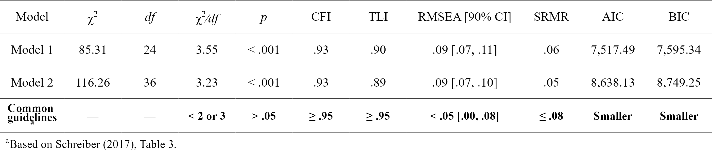

<!-- README.md is generated from README.Rmd. Please edit that file -->

```{r, include = FALSE}
knitr::opts_chunk$set(
  collapse = TRUE,
  comment = "#>",
  fig.path = "man/figures/README-",
  out.width = "100%"
)
```

# lavaanExtra: Convenience functions for `lavaan`

```{r version, echo = FALSE, message = FALSE, warning = FALSE}
flextable::set_flextable_defaults(background.color = "white")

library(lavaanExtra)
library(lavaan)
```

<!-- badges: start -->
[](https://lifecycle.r-lib.org/articles/stages.html#experimental)
[](https://CRAN.R-project.org/package=lavaanExtra)
<!-- badges: end -->

Affords an alternative, vector-based syntax to `lavaan`, as well as other convenience functions such as naming paths and defining indirect links automatically. Also offers convenience formatting optimized for a publication and script sharing workflow.

## Installation

You can install the development version of `lavaanExtra` like so:

``` r
install.packages("lavaanExtra", repos = c(
  rempsyc = "https://rempsyc.r-universe.dev",
  CRAN = "https://cloud.r-project.org"))
```

## Regression example

```{r reg}
# Define our regression terms
(regression <- list(mpg = names(mtcars)[-1],
                    disp = names(mtcars)[-c(1:3)]))

# Load library, write the model, and check it
library(lavaanExtra)
mtcars.model <- write_lavaan(regression = regression)
cat(mtcars.model)

# Fit the model with `lavaan`
library(lavaan)
fit <- lavaan(mtcars.model, data = mtcars, auto.var = TRUE)

# Get regression parameters only
lavaan_reg(fit)

# We can get it prettier with `rempsyc::nice_table`
library(rempsyc)
nice_table(lavaan_reg(fit), highlight = TRUE)

```


## SEM example

Here is a structural equation model example. We start with a path analysis first.

### Saturated model

The first step is usually to look at the saturated `lavaan` model.

```{r saturated}

# Calculate scale averages
data <- HolzingerSwineford1939
data$visual <- rowMeans(data[paste0("x", 1:3)])
data$textual <- rowMeans(data[paste0("x", 4:6)])
data$speed <- rowMeans(data[paste0("x", 7:9)])

# Check what we have
head(data)

# Define our variables
(m <- "visual")
(IV <- c("ageyr", "grade"))
#(DV <- c("speed", "textual"))

# Define our lavaan lists
(mediation <- list(speed = m,
                   textual = m,
                   visual = IV))
(regression <- list(speed = IV,
                    textual = IV))
(covariance <- list(speed = "textual",
                    ageyr = "grade"))

# Write the model, and check it
fit.saturated <- write_lavaan(mediation, regression, covariance)
cat(fit.saturated)

# Fit the model with `lavaan`
fit.saturated <- lavaan(fit.saturated, data = data, auto.var = TRUE)

# Get regression parameters only and make it pretty with `rempsyc::nice_table`
lavaan_reg(fit.saturated) |> 
  nice_table(highlight = TRUE)

```


So `speed` as predicted by `ageyr` isn't significant. We could remove that path from the model it if we are trying to make a more parsimonious model. Let's make the non-saturated path analysis model next.

### Path analysis model

Because we use `lavaanExtra`, we don't have to redefine the entire model: simply what we want to update. In this case, the regressions. However, we also want to specify and test our indirect effects (mediation). For this, we have to obtain the path names by setting `label = TRUE`. This will allow us to define our indirect effects and feed them back to `write_lavaan`.

```{r path}
(regression <- list(speed = "grade",
                    textual = IV))
# We check that we have removed "ageyr" correctly from "speed". OK.

# We can run the model again. However, we set `label = TRUE` to get the path names
model.path <- write_lavaan(mediation, regression, covariance, label = TRUE)
cat(model.path)
# We check that we have removed "ageyr" correctly from "speed" in the 
# regression section. OK.
```

Here, if we check the mediation section of the model, we see that it has been "augmented" with the path names. Those are `speed_a`, `textual_a`, `visual_a`, and `visual_b`. The logic for the determination of the path names is predictable: it is always the dependent variable (on the left) followed by letters, which represent the number of the explanatory variable (on the right).

```{r}
(indirect <- list(age_visual_speed = c("speed_a", "visual_a"),
                  grade_visual_textual = c("textual_a", "visual_b")))

# We run the model again, with the indirect effects
model.path <- write_lavaan(mediation, regression, covariance, indirect, label = TRUE)
cat(model.path)

# Fit the model with `lavaan`
fit.path <- lavaan(model.path, data = data, auto.var = TRUE)

# We can get the fit summary if necessary, but the output is a bit long
summary(fit.path)

# Get regression parameters only and make it pretty with `rempsyc::nice_table`
lavaan_reg(fit.path) |> 
  nice_table(highlight = TRUE)
```


```{r path2}
# We only kept significant regressions. Good (for this demo).

# Get fit indices
nice_fit(fit.path)

# We can get it prettier with `rempsyc::nice_table`
nice_table(nice_fit(fit.path))

# Let's get the indirect effects only
parameterEstimates(fit.path, standardized = TRUE)[which(parameterEstimates(fit.path)$op == ":="),]

```



For reference, this is our model, visually speaking

<!--  -->

### Latent model

Finally, perhaps we change our mind and decide to run a full SEM instead, with latent variables. Fear not: we don't have to redo everything again. We can simply define our latent variables and proceed.

```{r latent}
(latent <- list(visual = paste0("x", 1:3),
                textual = paste0("x", 4:6),
                speed = paste0("x", 7:9)))

model.latent <- write_lavaan(mediation, regression, covariance, indirect, latent, label = TRUE)
cat(model.latent)

library(lavaan)
fit.latent <- lavaan(model.latent, data = HolzingerSwineford1939, auto.var = TRUE, 
              auto.fix.first = TRUE, auto.cov.lv.x = TRUE)
summary(fit.latent, fit.measures = TRUE)
```

### Compare performance of all models

Finally, we can compare our fits by a wrapper around `nice_fit` that also gives optional reference values.

```{r compare}
# Default output
compare_fit(fit.saturated, fit.path, fit.latent)

# With `nice_table = TRUE`
compare_fit(fit.saturated, fit.path, fit.latent, nice_table = TRUE)

```


