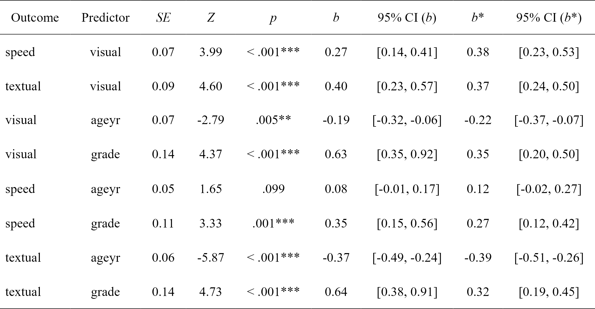

<!-- README.md is generated from README.Rmd. Please edit that file -->

```{r, include = FALSE}
knitr::opts_chunk$set(
  collapse = TRUE,
  comment = "#>",
  fig.path = "man/figures/README-",
  out.width = "100%"
)
```

# lavaanExtra: Convenience functions for `lavaan`

```{r version, echo = FALSE, message = FALSE, warning = FALSE}
flextable::set_flextable_defaults(background.color = "white")

library(lavaan)
```

<!-- badges: start -->
[](https://github.com/rempsyc/lavaanExtra/actions/workflows/R-CMD-check.yaml)
[](https://rempsyc.r-universe.dev/ui#package:lavaanExtra)
[](https://www.repostatus.org/#active)
[](https://github.com/rempsyc/lavaanExtra/commits/main)

[](https://github.com/sponsors/rempsyc)
[](https://github.com/rempsyc?tab=followers)
[](https://github.com/rempsyc/lavaanExtra/network/members)
[](https://github.com/rempsyc/lavaanExtra/stargazers)

<!-- badges: end -->

Affords an alternative, vector-based syntax to `lavaan`, as well as other convenience functions such as naming paths and defining indirect links automatically. Also offers convenience formatting optimized for a publication and script sharing workflow.

## Installation

You can install the development version of `lavaanExtra` like so:

``` r
install.packages("lavaanExtra", repos = c(
  rempsyc = "https://rempsyc.r-universe.dev",
  CRAN = "https://cloud.r-project.org"))
```

## Overview

```{r headers, results = "asis", echo = FALSE}

section.1 <- "Regression example"
section.2 <- "CFA example"
section.3 <- "SEM example"
section.4 <- "Saturated model"
section.5 <- "Path analysis model"
section.6 <- "Latent model"

cute_cat <- function(x, header.level = 1){ 
  cat(rep("#", header.level), " ", x, sep = "")
}

cute_TOC <- function(section) {
  cat("[", section, "]",
      "(#", tolower(gsub(" ", "-", gsub(",", "", section))), ")",
      "<a name = '", section, "'/>",
      "\n \n",
      sep = "")
}

invisible(lapply(list(
  section.1, section.2, section.3, section.4, section.5, section.6), 
  cute_TOC))

```

## Regression example

```{r reg}
# Define our regression terms
(regression <- list(mpg = names(mtcars)[2:5],
                    disp = names(mtcars)[4:7]))

# Load library, write the model, and check it
library(lavaanExtra)
mtcars.model <- write_lavaan(regression = regression)
cat(mtcars.model)

# Fit the model with `lavaan`
library(lavaan)
fit.reg <- lavaan(mtcars.model, data = mtcars, auto.var = TRUE)

# Get regression parameters only
lavaan_reg(fit.reg)

# We can get it prettier with the `rempsyc::nice_table` integration
lavaan_reg(fit.reg, nice_table = TRUE, highlight = TRUE)

```


## CFA example

```{r cfa}
# Define latent variables
(latent <- list(visual = paste0("x", 1:3),
                textual = paste0("x", 4:6),
                speed = paste0("x", 7:9)))

# Write the model, and check it
cfa.model <- write_lavaan(latent = latent)
cat(cfa.model)

# Fit the model with `lavaan`
fit.cfa <- cfa(cfa.model, data = HolzingerSwineford1939)

# Get the summary output
summary(fit.cfa, fit.measures = TRUE)

# Get fit indices
nice_fit(fit.cfa)

# We can get it prettier with the `rempsyc::nice_table` integration
nice_fit(fit.cfa, nice_table = TRUE)

```


## SEM example

Here is a structural equation model example. We start with a path analysis first.

### Saturated model

The first step is usually to look at the saturated `lavaan` model.

```{r saturated}

# Calculate scale averages
data <- HolzingerSwineford1939
data$visual <- rowMeans(data[paste0("x", 1:3)])
data$textual <- rowMeans(data[paste0("x", 4:6)])
data$speed <- rowMeans(data[paste0("x", 7:9)])

# Check what we have
head(data)

# Define our variables
(m <- "visual")
(IV <- c("ageyr", "grade"))
#(DV <- c("speed", "textual"))

# Define our lavaan lists
(mediation <- list(speed = m,
                   textual = m,
                   visual = IV))
(regression <- list(speed = IV,
                    textual = IV))
(covariance <- list(speed = "textual",
                    ageyr = "grade"))

# Write the model, and check it
fit.saturated <- write_lavaan(mediation, regression, covariance)
cat(fit.saturated)

# Fit the model with `lavaan`
fit.saturated <- lavaan(fit.saturated, data = data, auto.var = TRUE)

# Get regression parameters only and make it pretty with the `rempsyc::nice_table` integration
lavaan_reg(fit.saturated, nice_table = TRUE, highlight = TRUE)

```



So `speed` as predicted by `ageyr` isn't significant. We could remove that path from the model it if we are trying to make a more parsimonious model. Let's make the non-saturated path analysis model next.

### Path analysis model

Because we use `lavaanExtra`, we don't have to redefine the entire model: simply what we want to update. In this case, the regressions. However, we also want to specify and test our indirect effects (mediation). For this, we have to obtain the path names by setting `label = TRUE`. This will allow us to define our indirect effects and feed them back to `write_lavaan`.

```{r path}
(regression <- list(speed = "grade",
                    textual = IV))
# We check that we have removed "ageyr" correctly from "speed". OK.

# We can run the model again. However, we set `label = TRUE` to get the path names
model.path <- write_lavaan(mediation, regression, covariance, label = TRUE)
cat(model.path)
# We check that we have removed "ageyr" correctly from "speed" in the 
# regression section. OK.
```

Here, if we check the mediation section of the model, we see that it has been "augmented" with the path names. Those are `speed_a`, `textual_a`, `visual_a`, and `visual_b`. The logic for the determination of the path names is predictable: it is always the dependent variable (on the left) followed by letters, which represent the number of the explanatory variable (on the right).

```{r indirect1}
(indirect <- list(age_visual_speed = c("speed_a", "visual_a"),
                  grade_visual_textual = c("textual_a", "visual_b")))

# We run the model again, with the indirect effects
model.path <- write_lavaan(mediation, regression, covariance, indirect, label = TRUE)
cat(model.path)

# Fit the model with `lavaan`
fit.path <- lavaan(model.path, data = data, auto.var = TRUE)

# Get regression parameters only and make it pretty with the `rempsyc::nice_table` integration
lavaan_reg(fit.path, nice_table = TRUE, highlight = TRUE)
```


```{r covariance}
# We only kept significant regressions—good (for this demo).

# Get covariance indices
lavaan_cov(fit.path)

# We can get it prettier with the `rempsyc::nice_table` integration
lavaan_cov(fit.path, nice_table = TRUE)

```


```{r path2}
# Get fit indices
nice_fit(fit.cfa, fit.saturated, fit.path)

# We can get it prettier with the `rempsyc::nice_table` integration
nice_fit(fit.cfa, fit.saturated, fit.path, nice_table = TRUE)

```


```{r indirect2}
# Let's get the indirect effects only
lavaan_ind(fit.path)

# We can get it prettier with the `rempsyc::nice_table` integration
lavaan_ind(fit.path, nice_table = TRUE)

```


For reference, this is our model, visually speaking


### Latent model

Finally, perhaps we change our mind and decide to run a full SEM instead, with latent variables. Fear not: we don't have to redo everything again. We can simply define our latent variables and proceed. In this example, we have *already* defined our latent variable for our CFA earlier, so we don't even need to write that again!

```{r latent}
model.latent <- write_lavaan(mediation, regression, covariance, 
                             indirect, latent, label = TRUE)
cat(model.latent)

# Run model
fit.latent <- lavaan(model.latent, data = HolzingerSwineford1939, auto.var = TRUE, 
              auto.fix.first = TRUE, auto.cov.lv.x = TRUE)

# Get fit indices
nice_fit(fit.cfa, fit.saturated, fit.path, fit.latent)

# We can get it prettier with the `rempsyc::nice_table` integration
nice_fit(fit.cfa, fit.saturated, fit.path, fit.latent, nice_table = TRUE)

```


## Support me and this package

Thank you for your support. You can support me and this package here: https://github.com/sponsors/rempsyc
