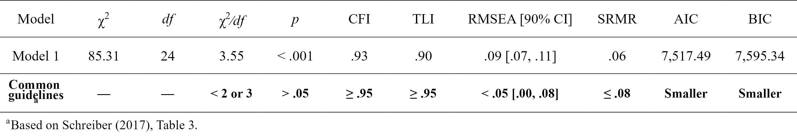

<!-- README.md is generated from README.Rmd. Please edit that file -->

```{r, include = FALSE}
knitr::opts_chunk$set(
  collapse = TRUE,
  comment = "#>",
  fig.path = "man/figures/README-",
  out.width = "100%"
)
```

# lavaanExtra: Convenience functions for `lavaan`

```{r version, echo = FALSE, message = FALSE, warning = FALSE}
flextable::set_flextable_defaults(background.color = "white")

library(lavaan)
```

<!-- badges: start -->
[](https://github.com/rempsyc/lavaanExtra/actions/workflows/R-CMD-check.yaml)
[](https://rempsyc.r-universe.dev/ui#package:lavaanExtra)
[](https://www.repostatus.org/#active)
[](https://github.com/rempsyc/lavaanExtra/commits/main)

[](https://github.com/sponsors/rempsyc)
[](https://github.com/rempsyc?tab=followers)
[](https://github.com/rempsyc/lavaanExtra/network/members)
[](https://github.com/rempsyc/lavaanExtra/stargazers)

<!-- badges: end -->

Affords an alternative, vector-based syntax to `lavaan`, as well as other convenience functions such as naming paths and defining indirect links automatically. Also offers convenience formatting optimized for a publication and script sharing workflow.

## Installation

You can install the development version of `lavaanExtra` like so:

``` r
install.packages("lavaanExtra", repos = c(
  rempsyc = "https://rempsyc.r-universe.dev",
  CRAN = "https://cloud.r-project.org"))
```

## Why use `lavaanExtra`?

1. **Reusable code**. Don't repeat yourself anymore when you only want to change a few things when comparing and fitting models.
2. **Shorter code**. Because of point 1, you can have shorter code, since you write it once and simply reuse it. For items with similar patterns, you can also use `paste0()` with appropriate item numbers instead of typing each one every time.
3. **Less error-prone code**. Because of point 1, you can have less risk of human errors since you don't have possibly multiple different version of the same thing (which makes it easier to correct too).
4. **Better control over your code**. Because of point 1, you are in control of the whole flow. You change it once, and it will change it everywhere else in the script, without having to change it manually for each model.
5. **More readable code**. Because of point 1, other people (but also yourself) only have to process the information the first time to make sure it's been specified correctly, and not every time you check the new models.
6. **Prettier code**. Because it will format the model for you in a pretty way, every time. You don't have to worry about manually making your model good-looking and readable anymore.
7. **More accessible code**. You don't have to remember the exact syntax (although it is recommended) for it to work. It uses intuitive variable names that most people can understand. This benefit is most apparent for beginners, but it also saves precious typing time for veterans.

## Overview

```{r headers, results = "asis", echo = FALSE}

section.1 <- "Regression example"
section.2 <- "CFA example"
section.3 <- "SEM example"
section.4 <- "Saturated model"
section.5 <- "Path analysis model"
section.6 <- "Latent model"
section.7 <- "Special cases"

cute_cat <- function(x, header.level = 1){ 
  cat(rep("#", header.level), " ", x, sep = "")
}

cute_TOC <- function(section) {
  cat("[", section, "]",
      "(#", tolower(gsub(" ", "-", gsub(",", "", section))), ")",
      "<a name = '", section, "'/>",
      "\n \n",
      sep = "")
}

invisible(lapply(list(
  section.1, section.2, section.3, section.4, section.5, 
  section.6, section.7), 
  cute_TOC))

```

## Regression example

```{r reg}
# Define our regression terms
regression <- list(mpg = names(mtcars)[2:5],
                   disp = names(mtcars)[4:7])

# Load library
library(lavaanExtra)

# Write the model, and check it
mtcars.model <- write_lavaan(regression = regression)
cat(mtcars.model)

# Fit the model with `lavaan`
library(lavaan)
fit.reg <- lavaan(mtcars.model, data = mtcars, auto.var = TRUE)

# Get regression parameters only
lavaan_reg(fit.reg)

# We can get it prettier with the `rempsyc::nice_table` integration
lavaan_reg(fit.reg, nice_table = TRUE, highlight = TRUE)

```


## CFA example

```{r cfaplot1}
# Define latent variables
latent <- list(visual = paste0("x", 1:3),
               textual = paste0("x", 4:6),
               speed = paste0("x", 7:9))

# Write the model, and check it
cfa.model <- write_lavaan(latent = latent)
cat(cfa.model)
```

```{r cfaplot2}
# Fit the model fit and plot with `lavaanExtra::cfa_fit_plot`
# to get the factor loadings visually (optionally as PDF)
fit.cfa <- cfa_fit_plot(cfa.model, HolzingerSwineford1939)
```


```{r cfa2}
# Get fit indices
nice_fit(fit.cfa)

# We can get it prettier with the `rempsyc::nice_table` integration
nice_fit(fit.cfa, nice_table = TRUE)

```



But let's say you had a bad fit and wanted to remove the three items with the lowest loadings, you can do so without have to respecify the model, only what items you wish to remove:

```{r cfaplot4}
# Fit the model fit and plot with `lavaanExtra::cfa_fit_plot`
# to get the factor loadings visually (as PDF)
fit.cfa2 <- cfa_fit_plot(cfa.model, HolzingerSwineford1939,
                         remove.items = paste0("x", c(2:3, 7)))
```


Let's compare the fit to see if it's better now:

```{r cfaplot5}
nice_fit(fit.cfa, fit.cfa2, nice_table = TRUE)
```


It is! If you like this table, you may also wish to save it to Word. Also easy:

```{r cfaplot6}
# Save fit table as an object
fit_table <- nice_fit(fit.cfa, fit.cfa2, nice_table = TRUE)

# Save fit table to Word!
save_as_docx(fit_table, path = "fit_table.docx")
```

## SEM example

Here is a structural equation model example. We start with a path analysis first.

### Saturated model

One might decide to look at the saturated `lavaan` model first.

```{r saturated}
# Calculate scale averages
data <- HolzingerSwineford1939
data$visual <- rowMeans(data[paste0("x", 1:3)])
data$textual <- rowMeans(data[paste0("x", 4:6)])
data$speed <- rowMeans(data[paste0("x", 7:9)])

# Define our variables
M <- "visual"
IV <- c("ageyr", "grade")
DV <- c("speed", "textual")

# Define our lavaan lists
mediation <- list(speed = M, textual = M, visual = IV)
regression <- list(speed = IV, textual = IV)
covariance <- list(speed = "textual", ageyr = "grade")

# Write the model, and check it
model.saturated <- write_lavaan(mediation, regression, covariance)
cat(model.saturated)

```

This looks good so far, but we might also want to check our indirect effects (mediations). For this, we have to obtain the path names by setting `label = TRUE`. This will allow us to define our indirect effects and feed them back to `write_lavaan`.

```{r saturated2}
# We can run the model again. However, we set `label = TRUE` to get the path names
model.saturated <- write_lavaan(mediation, regression, covariance, label = TRUE)
cat(model.saturated)

```

Here, if we check the mediation section of the model, we see that it has been "augmented" with the path names. Those are `visual_speed`, `visual_textual`, `ageyr_visual`, and `grade_visual`. The logic for the determination of the path names is predictable: it is always the predictor variable, on the left, followed by the predicted variable, on the right. So if we were to test all possible indirect effects, we would define our `indirect` object as such:

```{r saturated3}
# Define indirect object
indirect <- list(ageyr_visual_speed = c("ageyr_visual", "visual_speed"),
                 ageyr_visual_textual = c("ageyr_visual", "visual_textual"),
                 grade_visual_speed = c("grade_visual", "visual_speed"),
                 grade_visual_textual = c("grade_visual", "visual_textual"))

# Write the model, and check it
model.saturated <- write_lavaan(mediation, regression, covariance, 
                                indirect, label = TRUE)
cat(model.saturated)

```

If preferred (e.g., when dealing with long variable names), one can choose to use letters for the predictor variables. Note however that this tends to be somewhat more confusing and ambiguous.

```{r letters}
# Write the model, and check it
model.saturated <- write_lavaan(mediation, regression, covariance, 
                                label = TRUE, use.letters = TRUE)
cat(model.saturated)
```

In this case, the path names are `a_speed`, `a_textual`, `a_visual`, and `b_visual`. So we would define our `indirect` object as such:

```{r letters2}
# Define indirect object
indirect <- list(ageyr_visual_speed = c("a_visual", "a_speed"),
                 ageyr_visual_textual = c("a_visual", "a_textual"),
                 grade_visual_speed = c("b_visual", "a_speed"),
                 grade_visual_textual = c("b_visual", "a_textual"))

# Write the model, and check it
model.saturated <- write_lavaan(mediation, regression, covariance, 
                                indirect, label = TRUE, use.letters = TRUE)
cat(model.saturated)

```

There is also an experimental feature that attempts to produce the indirect effects automatically. This feature requires specifying your independent, dependent, and mediator variables as "IV", "M", and "DV", respectively, in the `indirect` object. In our case, we have already defined those earlier, so we can just feed the proper objects.

```{r saturated4}
# Define indirect object
indirect <- list(IV = IV, M = M, DV = DV)

# Write the model, and check it
model.saturated <- write_lavaan(mediation, regression, covariance, 
                                indirect, label = TRUE)
cat(model.saturated)

```

We are now satisfied with our model, so we can finally fit it!

```{r saturated5}
# Fit the model with `lavaan`
fit.saturated <- lavaan(model.saturated, data = data, auto.var = TRUE)

# Get regression parameters only and make it pretty with the `rempsyc::nice_table` integration
lavaan_reg(fit.saturated, nice_table = TRUE, highlight = TRUE)

```


So `speed` as predicted by `ageyr` isn't significant. We could remove that path from the model it if we are trying to make a more parsimonious model. Let's make the non-saturated path analysis model next.

### Path analysis model

Because we use `lavaanExtra`, we don't have to redefine the entire model: simply what we want to update. In this case, the regressions and the indirect effects.

```{r path}
regression <- list(speed = "grade", textual = IV)
# We check that we have removed "ageyr" correctly from "speed". OK.

# We can run the model again, setting `label = TRUE` to get the path names
model.path <- write_lavaan(mediation, regression, covariance, label = TRUE)
cat(model.path)
# We check that we have removed "ageyr" correctly from "speed" in the 
# regression section. OK.

# Define just our indirect effects of interest
indirect <- list(age_visual_speed = c("ageyr_visual", "visual_speed"),
                 grade_visual_textual = c("grade_visual", "visual_textual"))

# We run the model again, with the indirect effects
model.path <- write_lavaan(mediation, regression, covariance, 
                           indirect, label = TRUE)
cat(model.path)

# Fit the model with `lavaan`
fit.path <- lavaan(model.path, data = data, auto.var = TRUE)

# Get regression parameters only and make it pretty with the `rempsyc::nice_table` integration
lavaan_reg(fit.path, nice_table = TRUE, highlight = TRUE)
```


```{r covariance}
# We only kept significant regressions. Good (for this demo).

# Get covariance indices
lavaan_cov(fit.path)

# We can get it prettier with the `rempsyc::nice_table` integration
lavaan_cov(fit.path, nice_table = TRUE)

```


```{r path2}
# Get nice fit indices with the `rempsyc::nice_table` integration
nice_fit(fit.cfa, fit.saturated, fit.path, nice_table = TRUE)

```


```{r indirect2}
# Let's get the indirect effects only
lavaan_ind(fit.path)

# We can get it prettier with the `rempsyc::nice_table` integration
lavaan_ind(fit.path, nice_table = TRUE)

```


```{r mi}
# Get modification indices only
modindices(fit.path, sort = TRUE, maximum.number = 5)
```

For reference, this is our model, visually speaking


### Latent model

Finally, perhaps we change our mind and decide to run a full SEM instead, with latent variables. Fear not: we don't have to redo everything again. We can simply define our latent variables and proceed. In this example, we have *already* defined our latent variable for our CFA earlier, so we don't even need to write that again!

```{r latent}
model.latent <- write_lavaan(mediation, regression, covariance, 
                             indirect, latent, label = TRUE)
cat(model.latent)

# Run model
fit.latent <- lavaan(model.latent, data = HolzingerSwineford1939, auto.var = TRUE, 
              auto.fix.first = TRUE, auto.cov.lv.x = TRUE)

# Get nice fit indices with the `rempsyc::nice_table` integration
nice_fit(fit.cfa, fit.saturated, fit.path, fit.latent, nice_table = TRUE)

```


# Special cases

Finally, intercepts and various constraints can also be specified, e.g.:

```{r}
intercept <- c("mpg", "cyl", "disp")
constraint.equal <- list(b1 = "(b2 + b3)^2")
constraint.smaller <- list(b1 = "exp(b2 + b3)")
constraint.larger <- list(b1 = "exp(b2 + b3)")
custom <- "y1 + y2 ~ f1 + f2 + x1 + x2"

model.custom <- write_lavaan(
  intercept = intercept, constraint.equal = constraint.equal, 
  constraint.smaller = constraint.smaller, 
  constraint.larger = constraint.larger, custom = custom)
cat(model.custom)

```

### Final note
This is an experimental package in a *very* early stage. Any feedback or feature request is appreciated, and the package will likely change and evolve over time based on community feedback. Feel free to open an issue or discussion to share your questions or concerns.

## Support me and this package

Thank you for your support. You can support me and this package here: https://github.com/sponsors/rempsyc
