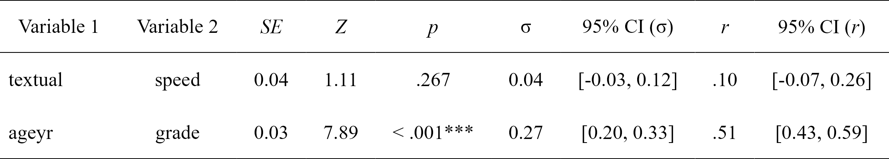
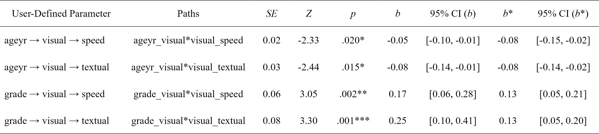

<!-- README.md is generated from README.Rmd. Please edit that file -->

# lavaanExtra: Convenience functions for `lavaan`

<!-- badges: start -->

[](https://github.com/rempsyc/lavaanExtra/actions/workflows/R-CMD-check.yaml)
[](https://rempsyc.r-universe.dev/ui#package:lavaanExtra)
[](https://www.repostatus.org/#active)
[](https://github.com/rempsyc/lavaanExtra/commits/main)

[](https://github.com/sponsors/rempsyc)
[](https://github.com/rempsyc?tab=followers)
[](https://github.com/rempsyc/lavaanExtra/network/members)
[](https://github.com/rempsyc/lavaanExtra/stargazers)

<!-- badges: end -->

Affords an alternative, vector-based syntax to `lavaan`, as well as
other convenience functions such as naming paths and defining indirect
links automatically. Also offers convenience formatting optimized for a
publication and script sharing workflow.

## Installation

You can install the development version of `lavaanExtra` like so:

``` r
install.packages("lavaanExtra", repos = c(
  rempsyc = "https://rempsyc.r-universe.dev",
  CRAN = "https://cloud.r-project.org"))
```

## Overview

[Regression
example](#regression-example)<a name = 'Regression example'/>

[CFA example](#cfa-example)<a name = 'CFA example'/>

[SEM example](#sem-example)<a name = 'SEM example'/>

[Saturated model](#saturated-model)<a name = 'Saturated model'/>

[Path analysis
model](#path-analysis-model)<a name = 'Path analysis model'/>

[Latent model](#latent-model)<a name = 'Latent model'/>

## Regression example

``` r
# Define our regression terms
(regression <- list(mpg = names(mtcars)[2:5],
                    disp = names(mtcars)[4:7]))
#> $mpg
#> [1] "cyl"  "disp" "hp"   "drat"
#> 
#> $disp
#> [1] "hp"   "drat" "wt"   "qsec"

# Load library, write the model, and check it
library(lavaanExtra)
#> Suggested citation: Thériault, R. (2022). lavaanExtra: Convenience functions for lavaan (R package version 0.0.0.9) [Computer software]. https://lavaanExtra.remi-theriault.com/
mtcars.model <- write_lavaan(regression = regression)
cat(mtcars.model)
#> ##################################################
#> # [---------Regressions (Direct effects)---------]
#> 
#> mpg ~ cyl + disp + hp + drat
#> disp ~ hp + drat + wt + qsec

# Fit the model with `lavaan`
library(lavaan)
fit.reg <- lavaan(mtcars.model, data = mtcars, auto.var = TRUE)

# Get regression parameters only
lavaan_reg(fit.reg)
#>   Outcome Predictor      B     p
#> 1     mpg       cyl -0.242 0.244
#> 2     mpg      disp -0.287 0.123
#> 3     mpg        hp -0.264 0.128
#> 4     mpg      drat  0.192 0.159
#> 5    disp        hp  0.175 0.177
#> 6    disp      drat -0.177 0.034
#> 7    disp        wt  0.614 0.000
#> 8    disp      qsec -0.186 0.061

# We can get it prettier with the `rempsyc::nice_table` integration
lavaan_reg(fit.reg, nice_table = TRUE, highlight = TRUE)
```


## CFA example

``` r
# Define latent variables
(latent <- list(visual = paste0("x", 1:3),
                textual = paste0("x", 4:6),
                speed = paste0("x", 7:9)))
#> $visual
#> [1] "x1" "x2" "x3"
#> 
#> $textual
#> [1] "x4" "x5" "x6"
#> 
#> $speed
#> [1] "x7" "x8" "x9"

# Write the model, and check it
cfa.model <- write_lavaan(latent = latent)
cat(cfa.model)
#> ##################################################
#> # [---------------Latent variables---------------]
#> 
#> visual =~ x1 + x2 + x3
#> textual =~ x4 + x5 + x6
#> speed =~ x7 + x8 + x9

# Fit the model with `lavaan`
fit.cfa <- cfa(cfa.model, data = HolzingerSwineford1939)

# Get the summary output
summary(fit.cfa, fit.measures = TRUE)
#> lavaan 0.6-12 ended normally after 35 iterations
#> 
#>   Estimator                                         ML
#>   Optimization method                           NLMINB
#>   Number of model parameters                        21
#> 
#>   Number of observations                           301
#> 
#> Model Test User Model:
#>                                                       
#>   Test statistic                                85.306
#>   Degrees of freedom                                24
#>   P-value (Chi-square)                           0.000
#> 
#> Model Test Baseline Model:
#> 
#>   Test statistic                               918.852
#>   Degrees of freedom                                36
#>   P-value                                        0.000
#> 
#> User Model versus Baseline Model:
#> 
#>   Comparative Fit Index (CFI)                    0.931
#>   Tucker-Lewis Index (TLI)                       0.896
#> 
#> Loglikelihood and Information Criteria:
#> 
#>   Loglikelihood user model (H0)              -3737.745
#>   Loglikelihood unrestricted model (H1)      -3695.092
#>                                                       
#>   Akaike (AIC)                                7517.490
#>   Bayesian (BIC)                              7595.339
#>   Sample-size adjusted Bayesian (BIC)         7528.739
#> 
#> Root Mean Square Error of Approximation:
#> 
#>   RMSEA                                          0.092
#>   90 Percent confidence interval - lower         0.071
#>   90 Percent confidence interval - upper         0.114
#>   P-value RMSEA <= 0.05                          0.001
#> 
#> Standardized Root Mean Square Residual:
#> 
#>   SRMR                                           0.065
#> 
#> Parameter Estimates:
#> 
#>   Standard errors                             Standard
#>   Information                                 Expected
#>   Information saturated (h1) model          Structured
#> 
#> Latent Variables:
#>                    Estimate  Std.Err  z-value  P(>|z|)
#>   visual =~                                           
#>     x1                1.000                           
#>     x2                0.554    0.100    5.554    0.000
#>     x3                0.729    0.109    6.685    0.000
#>   textual =~                                          
#>     x4                1.000                           
#>     x5                1.113    0.065   17.014    0.000
#>     x6                0.926    0.055   16.703    0.000
#>   speed =~                                            
#>     x7                1.000                           
#>     x8                1.180    0.165    7.152    0.000
#>     x9                1.082    0.151    7.155    0.000
#> 
#> Covariances:
#>                    Estimate  Std.Err  z-value  P(>|z|)
#>   visual ~~                                           
#>     textual           0.408    0.074    5.552    0.000
#>     speed             0.262    0.056    4.660    0.000
#>   textual ~~                                          
#>     speed             0.173    0.049    3.518    0.000
#> 
#> Variances:
#>                    Estimate  Std.Err  z-value  P(>|z|)
#>    .x1                0.549    0.114    4.833    0.000
#>    .x2                1.134    0.102   11.146    0.000
#>    .x3                0.844    0.091    9.317    0.000
#>    .x4                0.371    0.048    7.779    0.000
#>    .x5                0.446    0.058    7.642    0.000
#>    .x6                0.356    0.043    8.277    0.000
#>    .x7                0.799    0.081    9.823    0.000
#>    .x8                0.488    0.074    6.573    0.000
#>    .x9                0.566    0.071    8.003    0.000
#>     visual            0.809    0.145    5.564    0.000
#>     textual           0.979    0.112    8.737    0.000
#>     speed             0.384    0.086    4.451    0.000

# Get fit indices
nice_fit(fit.cfa)
#>     Model   chi2 df chi2.df p   CFI   TLI RMSEA  SRMR     AIC      BIC
#> 1 fit.cfa 85.306 24   3.554 0 0.931 0.896 0.092 0.065 7517.49 7595.339

# We can get it prettier with the `rempsyc::nice_table` integration
nice_fit(fit.cfa, nice_table = TRUE)
```


## SEM example

Here is a structural equation model example. We start with a path
analysis first.

### Saturated model

The first step is usually to look at the saturated `lavaan` model.

``` r

# Calculate scale averages
data <- HolzingerSwineford1939
data$visual <- rowMeans(data[paste0("x", 1:3)])
data$textual <- rowMeans(data[paste0("x", 4:6)])
data$speed <- rowMeans(data[paste0("x", 7:9)])

# Check what we have
head(data)
#>   id sex ageyr agemo  school grade       x1   x2    x3       x4   x5        x6
#> 1  1   1    13     1 Pasteur     7 3.333333 7.75 0.375 2.333333 5.75 1.2857143
#> 2  2   2    13     7 Pasteur     7 5.333333 5.25 2.125 1.666667 3.00 1.2857143
#> 3  3   2    13     1 Pasteur     7 4.500000 5.25 1.875 1.000000 1.75 0.4285714
#> 4  4   1    13     2 Pasteur     7 5.333333 7.75 3.000 2.666667 4.50 2.4285714
#> 5  5   2    12     2 Pasteur     7 4.833333 4.75 0.875 2.666667 4.00 2.5714286
#> 6  6   2    14     1 Pasteur     7 5.333333 5.00 2.250 1.000000 3.00 0.8571429
#>         x7   x8       x9   visual  textual    speed
#> 1 3.391304 5.75 6.361111 3.819444 3.123016 5.167472
#> 2 3.782609 6.25 7.916667 4.236111 1.984127 5.983092
#> 3 3.260870 3.90 4.416667 3.875000 1.059524 3.859179
#> 4 3.000000 5.30 4.861111 5.361111 3.198413 4.387037
#> 5 3.695652 6.30 5.916667 3.486111 3.079365 5.304106
#> 6 4.347826 6.65 7.500000 4.194444 1.619048 6.165942

# Define our variables
(m <- "visual")
#> [1] "visual"
(IV <- c("ageyr", "grade"))
#> [1] "ageyr" "grade"
#(DV <- c("speed", "textual"))

# Define our lavaan lists
(mediation <- list(speed = m,
                   textual = m,
                   visual = IV))
#> $speed
#> [1] "visual"
#> 
#> $textual
#> [1] "visual"
#> 
#> $visual
#> [1] "ageyr" "grade"
(regression <- list(speed = IV,
                    textual = IV))
#> $speed
#> [1] "ageyr" "grade"
#> 
#> $textual
#> [1] "ageyr" "grade"
(covariance <- list(speed = "textual",
                    ageyr = "grade"))
#> $speed
#> [1] "textual"
#> 
#> $ageyr
#> [1] "grade"

# Write the model, and check it
fit.saturated <- write_lavaan(mediation, regression, covariance)
cat(fit.saturated)
#> ##################################################
#> # [-----------Mediations (named paths)-----------]
#> 
#> speed ~ visual
#> textual ~ visual
#> visual ~ ageyr + grade
#> 
#> ##################################################
#> # [---------Regressions (Direct effects)---------]
#> 
#> speed ~ ageyr + grade
#> textual ~ ageyr + grade
#> 
#> ##################################################
#> # [------------------Covariances-----------------]
#> 
#> speed ~~ textual
#> ageyr ~~ grade

# Fit the model with `lavaan`
fit.saturated <- lavaan(fit.saturated, data = data, auto.var = TRUE)

# Get regression parameters only and make it pretty with the `rempsyc::nice_table` integration
lavaan_reg(fit.saturated, nice_table = TRUE, highlight = TRUE)
```


So `speed` as predicted by `ageyr` isn’t significant. We could remove
that path from the model it if we are trying to make a more parsimonious
model. Let’s make the non-saturated path analysis model next.

### Path analysis model

Because we use `lavaanExtra`, we don’t have to redefine the entire
model: simply what we want to update. In this case, the regressions.
However, we also want to specify and test our indirect effects
(mediation). For this, we have to obtain the path names by setting
`label = TRUE`. This will allow us to define our indirect effects and
feed them back to `write_lavaan`.

``` r
(regression <- list(speed = "grade",
                    textual = IV))
#> $speed
#> [1] "grade"
#> 
#> $textual
#> [1] "ageyr" "grade"
# We check that we have removed "ageyr" correctly from "speed". OK.

# We can run the model again. However, we set `label = TRUE` to get the path names
model.path <- write_lavaan(mediation, regression, covariance, label = TRUE)
cat(model.path)
#> ##################################################
#> # [-----------Mediations (named paths)-----------]
#> 
#> speed ~ speed_a*visual
#> textual ~ textual_a*visual
#> visual ~ visual_a*ageyr + visual_b*grade
#> 
#> ##################################################
#> # [---------Regressions (Direct effects)---------]
#> 
#> speed ~ grade
#> textual ~ ageyr + grade
#> 
#> ##################################################
#> # [------------------Covariances-----------------]
#> 
#> speed ~~ textual
#> ageyr ~~ grade
# We check that we have removed "ageyr" correctly from "speed" in the 
# regression section. OK.
```

Here, if we check the mediation section of the model, we see that it has
been “augmented” with the path names. Those are `speed_a`, `textual_a`,
`visual_a`, and `visual_b`. The logic for the determination of the path
names is predictable: it is always the dependent variable (on the left)
followed by letters, which represent the number of the explanatory
variable (on the right).

``` r
(indirect <- list(age_visual_speed = c("speed_a", "visual_a"),
                  grade_visual_textual = c("textual_a", "visual_b")))
#> $age_visual_speed
#> [1] "speed_a"  "visual_a"
#> 
#> $grade_visual_textual
#> [1] "textual_a" "visual_b"

# We run the model again, with the indirect effects
model.path <- write_lavaan(mediation, regression, covariance, indirect, label = TRUE)
cat(model.path)
#> ##################################################
#> # [-----------Mediations (named paths)-----------]
#> 
#> speed ~ speed_a*visual
#> textual ~ textual_a*visual
#> visual ~ visual_a*ageyr + visual_b*grade
#> 
#> ##################################################
#> # [---------Regressions (Direct effects)---------]
#> 
#> speed ~ grade
#> textual ~ ageyr + grade
#> 
#> ##################################################
#> # [------------------Covariances-----------------]
#> 
#> speed ~~ textual
#> ageyr ~~ grade
#> 
#> ##################################################
#> # [--------Mediations (indirect effects)---------]
#> 
#> age_visual_speed := speed_a * visual_a
#> grade_visual_textual := textual_a * visual_b

# Fit the model with `lavaan`
fit.path <- lavaan(model.path, data = data, auto.var = TRUE)

# Get regression parameters only and make it pretty with the `rempsyc::nice_table` integration
lavaan_reg(fit.path, nice_table = TRUE, highlight = TRUE)
```


``` r
# We only kept significant regressions—good (for this demo).

# Get covariance indices
lavaan_cov(fit.path)
#>    Variable.1 Variable.2     r     p
#> 8       speed    textual 0.131 0.024
#> 9       ageyr      grade 0.511 0.000
#> 10      speed      speed 0.824 0.000
#> 11    textual    textual 0.765 0.000
#> 12     visual     visual 0.942 0.000
#> 13      ageyr      ageyr 1.000 0.000
#> 14      grade      grade 1.000 0.000

# We can get it prettier with the `rempsyc::nice_table` integration
lavaan_cov(fit.path, nice_table = TRUE)
```



``` r
# Get fit indices
nice_fit(fit.cfa, fit.saturated, fit.path)
#>           Model   chi2 df chi2.df     p   CFI   TLI RMSEA  SRMR      AIC
#> 1       fit.cfa 85.306 24   3.554 0.000 0.931 0.896 0.092 0.065 7517.490
#> 2 fit.saturated  0.000  0     NaN    NA 1.000 1.000 0.000 0.000 3483.460
#> 3      fit.path  0.327  1   0.327 0.568 1.000 1.028 0.000 0.007 3481.787
#>        BIC
#> 1 7595.339
#> 2 3539.017
#> 3 3533.640

# We can get it prettier with the `rempsyc::nice_table` integration
nice_fit(fit.cfa, fit.saturated, fit.path, nice_table = TRUE)
```


``` r
# Let's get the indirect effects only
lavaan_ind(fit.path)
#>         Indirect.Effect              Paths      B     p
#> 15     age_visual_speed   speed_a*visual_a -0.033 0.037
#> 16 grade_visual_textual textual_a*visual_b  0.066 0.002

# We can get it prettier with the `rempsyc::nice_table` integration
lavaan_ind(fit.path, nice_table = TRUE)
```



For reference, this is our model, visually speaking


### Latent model

Finally, perhaps we change our mind and decide to run a full SEM
instead, with latent variables. Fear not: we don’t have to redo
everything again. We can simply define our latent variables and proceed.
In this example, we have *already* defined our latent variable for our
CFA earlier, so we don’t even need to write that again!

``` r
model.latent <- write_lavaan(mediation, regression, covariance, 
                             indirect, latent, label = TRUE)
cat(model.latent)
#> ##################################################
#> # [---------------Latent variables---------------]
#> 
#> visual =~ x1 + x2 + x3
#> textual =~ x4 + x5 + x6
#> speed =~ x7 + x8 + x9
#> 
#> ##################################################
#> # [-----------Mediations (named paths)-----------]
#> 
#> speed ~ speed_a*visual
#> textual ~ textual_a*visual
#> visual ~ visual_a*ageyr + visual_b*grade
#> 
#> ##################################################
#> # [---------Regressions (Direct effects)---------]
#> 
#> speed ~ grade
#> textual ~ ageyr + grade
#> 
#> ##################################################
#> # [------------------Covariances-----------------]
#> 
#> speed ~~ textual
#> ageyr ~~ grade
#> 
#> ##################################################
#> # [--------Mediations (indirect effects)---------]
#> 
#> age_visual_speed := speed_a * visual_a
#> grade_visual_textual := textual_a * visual_b

# Run model
fit.latent <- lavaan(model.latent, data = HolzingerSwineford1939, auto.var = TRUE, 
              auto.fix.first = TRUE, auto.cov.lv.x = TRUE)

# Get fit indices
nice_fit(fit.cfa, fit.saturated, fit.path, fit.latent)
#>           Model    chi2 df chi2.df     p   CFI   TLI RMSEA  SRMR      AIC
#> 1       fit.cfa  85.306 24   3.554 0.000 0.931 0.896 0.092 0.065 7517.490
#> 2 fit.saturated   0.000  0     NaN    NA 1.000 1.000 0.000 0.000 3483.460
#> 3      fit.path   0.327  1   0.327 0.568 1.000 1.028 0.000 0.007 3481.787
#> 4    fit.latent 118.917 37   3.214 0.000 0.924 0.888 0.086 0.061 8638.789
#>        BIC
#> 1 7595.339
#> 2 3539.017
#> 3 3533.640
#> 4 8746.198

# We can get it prettier with the `rempsyc::nice_table` integration
nice_fit(fit.cfa, fit.saturated, fit.path, fit.latent, nice_table = TRUE)
```


## Support me and this package

Thank you for your support. You can support me and this package here:
<https://github.com/sponsors/rempsyc>
