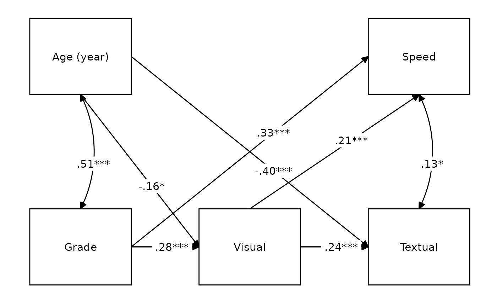

# Full CFA/SEM workflow

## CFA example

``` r
# Load library
library(lavaan)
library(lavaanExtra)
library(tibble)
library(psych)

# Define latent variables
x <- paste0("x", 1:9)
latent <- list(
  visual = x[1:3],
  textual = x[4:6],
  speed = x[7:9]
)

# Write the model, and check it
cfa.model <- write_lavaan(latent = latent)
cat(cfa.model)
```

    ## ##################################################
    ## # [-----Latent variables (measurement model)-----]
    ## 
    ## visual =~ x1 + x2 + x3
    ## textual =~ x4 + x5 + x6
    ## speed =~ x7 + x8 + x9

``` r
# Fit the model fit and plot with `lavaanExtra::cfa_fit_plot`
# to get the factor loadings visually (optionally as PDF)
fit.cfa <- cfa_fit_plot(cfa.model, HolzingerSwineford1939)
```

    ## lavaan 0.6-20 ended normally after 35 iterations
    ## 
    ##   Estimator                                         ML
    ##   Optimization method                           NLMINB
    ##   Number of model parameters                        21
    ## 
    ##   Number of observations                           301
    ## 
    ## Model Test User Model:
    ##                                               Standard      Scaled
    ##   Test Statistic                                85.306      87.132
    ##   Degrees of freedom                                24          24
    ##   P-value (Chi-square)                           0.000       0.000
    ##   Scaling correction factor                                  0.979
    ##     Yuan-Bentler correction (Mplus variant)                       
    ## 
    ## Model Test Baseline Model:
    ## 
    ##   Test statistic                               918.852     880.082
    ##   Degrees of freedom                                36          36
    ##   P-value                                        0.000       0.000
    ##   Scaling correction factor                                  1.044
    ## 
    ## User Model versus Baseline Model:
    ## 
    ##   Comparative Fit Index (CFI)                    0.931       0.925
    ##   Tucker-Lewis Index (TLI)                       0.896       0.888
    ##                                                                   
    ##   Robust Comparative Fit Index (CFI)                         0.930
    ##   Robust Tucker-Lewis Index (TLI)                            0.895
    ## 
    ## Loglikelihood and Information Criteria:
    ## 
    ##   Loglikelihood user model (H0)              -3737.745   -3737.745
    ##   Scaling correction factor                                  1.133
    ##       for the MLR correction                                      
    ##   Loglikelihood unrestricted model (H1)      -3695.092   -3695.092
    ##   Scaling correction factor                                  1.051
    ##       for the MLR correction                                      
    ##                                                                   
    ##   Akaike (AIC)                                7517.490    7517.490
    ##   Bayesian (BIC)                              7595.339    7595.339
    ##   Sample-size adjusted Bayesian (SABIC)       7528.739    7528.739
    ## 
    ## Root Mean Square Error of Approximation:
    ## 
    ##   RMSEA                                          0.092       0.093
    ##   90 Percent confidence interval - lower         0.071       0.073
    ##   90 Percent confidence interval - upper         0.114       0.115
    ##   P-value H_0: RMSEA <= 0.050                    0.001       0.001
    ##   P-value H_0: RMSEA >= 0.080                    0.840       0.862
    ##                                                                   
    ##   Robust RMSEA                                               0.092
    ##   90 Percent confidence interval - lower                     0.072
    ##   90 Percent confidence interval - upper                     0.114
    ##   P-value H_0: Robust RMSEA <= 0.050                         0.001
    ##   P-value H_0: Robust RMSEA >= 0.080                         0.849
    ## 
    ## Standardized Root Mean Square Residual:
    ## 
    ##   SRMR                                           0.065       0.065
    ## 
    ## Parameter Estimates:
    ## 
    ##   Standard errors                             Sandwich
    ##   Information bread                           Observed
    ##   Observed information based on                Hessian
    ## 
    ## Latent Variables:
    ##                    Estimate  Std.Err  z-value  P(>|z|)   Std.lv  Std.all
    ##   visual =~                                                             
    ##     x1                1.000                               0.900    0.772
    ##     x2                0.554    0.132    4.191    0.000    0.498    0.424
    ##     x3                0.729    0.141    5.170    0.000    0.656    0.581
    ##   textual =~                                                            
    ##     x4                1.000                               0.990    0.852
    ##     x5                1.113    0.066   16.946    0.000    1.102    0.855
    ##     x6                0.926    0.061   15.089    0.000    0.917    0.838
    ##   speed =~                                                              
    ##     x7                1.000                               0.619    0.570
    ##     x8                1.180    0.130    9.046    0.000    0.731    0.723
    ##     x9                1.082    0.266    4.060    0.000    0.670    0.665
    ## 
    ## Covariances:
    ##                    Estimate  Std.Err  z-value  P(>|z|)   Std.lv  Std.all
    ##   visual ~~                                                             
    ##     textual           0.408    0.099    4.110    0.000    0.459    0.459
    ##     speed             0.262    0.060    4.366    0.000    0.471    0.471
    ##   textual ~~                                                            
    ##     speed             0.173    0.056    3.081    0.002    0.283    0.283
    ## 
    ## Variances:
    ##                    Estimate  Std.Err  z-value  P(>|z|)   Std.lv  Std.all
    ##    .x1                0.549    0.156    3.509    0.000    0.549    0.404
    ##    .x2                1.134    0.112   10.135    0.000    1.134    0.821
    ##    .x3                0.844    0.100    8.419    0.000    0.844    0.662
    ##    .x4                0.371    0.050    7.382    0.000    0.371    0.275
    ##    .x5                0.446    0.057    7.870    0.000    0.446    0.269
    ##    .x6                0.356    0.047    7.658    0.000    0.356    0.298
    ##    .x7                0.799    0.097    8.222    0.000    0.799    0.676
    ##    .x8                0.488    0.120    4.080    0.000    0.488    0.477
    ##    .x9                0.566    0.119    4.768    0.000    0.566    0.558
    ##     visual            0.809    0.180    4.486    0.000    1.000    1.000
    ##     textual           0.979    0.121    8.075    0.000    1.000    1.000
    ##     speed             0.384    0.107    3.596    0.000    1.000    1.000
    ## 
    ## R-Square:
    ##                    Estimate
    ##     x1                0.596
    ##     x2                0.179
    ##     x3                0.338
    ##     x4                0.725
    ##     x5                0.731
    ##     x6                0.702
    ##     x7                0.324
    ##     x8                0.523
    ##     x9                0.442


``` r
# Get fit indices
nice_fit(fit.cfa)
```

    ##     Model  chisq df chi2.df pvalue   cfi   tli rmsea rmsea.ci.lower
    ## 1 Model 1 85.306 24   3.554      0 0.931 0.896 0.092          0.071
    ##   rmsea.ci.upper  srmr     aic      bic
    ## 1          0.114 0.055 7517.49 7595.339

``` r
# We can get it prettier with the `rempsyc::nice_table` integration
nice_fit(fit.cfa, nice_table = TRUE)
```

| Model                                | χ2    | df  | χ2∕df     | p       | CFI   | TLI   | RMSEA \[90% CI\]    | SRMR  | AIC      | BIC      |
|--------------------------------------|-------|-----|-----------|---------|-------|-------|---------------------|-------|----------|----------|
| Model 1                              | 85.31 | 24  | 3.55      | \< .001 | .93   | .90   | .09 \[.07, .11\]    | .06   | 7,517.49 | 7,595.34 |
| Common guidelinesa                   | —     | —   | \< 2 or 3 | \> .05  | ≥ .95 | ≥ .95 | \< .05 \[.00, .08\] | ≤ .08 | Smaller  | Smaller  |
| aBased on Schreiber (2017), Table 3. |       |     |           |         |       |       |                     |       |          |          |

But let’s say you wanted to develop a short-scale with only x items per
dimension. You could decide to remove, for each dimension, the items
with the lowest loadings to reach your desired number of items per
dimension (but have a look at the [Estimation of items
reliability](#estimation-of-items-reliability) section below). You can
do so without have to respecify the model, only what items you wish to
remove:

``` r
# Fit the model fit and plot with `lavaanExtra::cfa_fit_plot`
# to get the factor loadings visually (as PDF)
fit.cfa2 <- cfa_fit_plot(cfa.model, HolzingerSwineford1939,
  remove.items = x[c(2, 6:7)]
)
```

    ## lavaan 0.6-20 ended normally after 36 iterations
    ## 
    ##   Estimator                                         ML
    ##   Optimization method                           NLMINB
    ##   Number of model parameters                        15
    ## 
    ##   Number of observations                           301
    ## 
    ## Model Test User Model:
    ##                                               Standard      Scaled
    ##   Test Statistic                                13.109      13.560
    ##   Degrees of freedom                                 6           6
    ##   P-value (Chi-square)                           0.041       0.035
    ##   Scaling correction factor                                  0.967
    ##     Yuan-Bentler correction (Mplus variant)                       
    ## 
    ## Model Test Baseline Model:
    ## 
    ##   Test statistic                               481.386     460.467
    ##   Degrees of freedom                                15          15
    ##   P-value                                        0.000       0.000
    ##   Scaling correction factor                                  1.045
    ## 
    ## User Model versus Baseline Model:
    ## 
    ##   Comparative Fit Index (CFI)                    0.985       0.983
    ##   Tucker-Lewis Index (TLI)                       0.962       0.958
    ##                                                                   
    ##   Robust Comparative Fit Index (CFI)                         0.984
    ##   Robust Tucker-Lewis Index (TLI)                            0.961
    ## 
    ## Loglikelihood and Information Criteria:
    ## 
    ##   Loglikelihood user model (H0)              -2538.118   -2538.118
    ##   Scaling correction factor                                  1.076
    ##       for the MLR correction                                      
    ##   Loglikelihood unrestricted model (H1)      -2531.563   -2531.563
    ##   Scaling correction factor                                  1.045
    ##       for the MLR correction                                      
    ##                                                                   
    ##   Akaike (AIC)                                5106.235    5106.235
    ##   Bayesian (BIC)                              5161.842    5161.842
    ##   Sample-size adjusted Bayesian (SABIC)       5114.271    5114.271
    ## 
    ## Root Mean Square Error of Approximation:
    ## 
    ##   RMSEA                                          0.063       0.065
    ##   90 Percent confidence interval - lower         0.012       0.015
    ##   90 Percent confidence interval - upper         0.109       0.112
    ##   P-value H_0: RMSEA <= 0.050                    0.276       0.255
    ##   P-value H_0: RMSEA >= 0.080                    0.309       0.337
    ##                                                                   
    ##   Robust RMSEA                                               0.064
    ##   90 Percent confidence interval - lower                     0.016
    ##   90 Percent confidence interval - upper                     0.109
    ##   P-value H_0: Robust RMSEA <= 0.050                         0.262
    ##   P-value H_0: Robust RMSEA >= 0.080                         0.314
    ## 
    ## Standardized Root Mean Square Residual:
    ## 
    ##   SRMR                                           0.036       0.036
    ## 
    ## Parameter Estimates:
    ## 
    ##   Standard errors                             Sandwich
    ##   Information bread                           Observed
    ##   Observed information based on                Hessian
    ## 
    ## Latent Variables:
    ##                    Estimate  Std.Err  z-value  P(>|z|)   Std.lv  Std.all
    ##   visual =~                                                             
    ##     x1                1.000                               0.954    0.818
    ##     x3                0.637    0.119    5.343    0.000    0.608    0.538
    ##   textual =~                                                            
    ##     x4                1.000                               1.115    0.959
    ##     x5                0.883    0.140    6.292    0.000    0.985    0.764
    ##   speed =~                                                              
    ##     x8                1.000                               0.511    0.505
    ##     x9                1.754    0.398    4.405    0.000    0.896    0.889
    ## 
    ## Covariances:
    ##                    Estimate  Std.Err  z-value  P(>|z|)   Std.lv  Std.all
    ##   visual ~~                                                             
    ##     textual           0.472    0.098    4.798    0.000    0.444    0.444
    ##     speed             0.274    0.073    3.732    0.000    0.562    0.562
    ##   textual ~~                                                            
    ##     speed             0.144    0.055    2.590    0.010    0.252    0.252
    ## 
    ## Variances:
    ##                    Estimate  Std.Err  z-value  P(>|z|)   Std.lv  Std.all
    ##    .x1                0.448    0.172    2.606    0.009    0.448    0.330
    ##    .x3                0.905    0.085   10.670    0.000    0.905    0.710
    ##    .x4                0.107    0.190    0.564    0.573    0.107    0.080
    ##    .x5                0.690    0.160    4.311    0.000    0.690    0.416
    ##    .x8                0.761    0.088    8.623    0.000    0.761    0.745
    ##    .x9                0.213    0.165    1.294    0.196    0.213    0.210
    ##     visual            0.910    0.197    4.623    0.000    1.000    1.000
    ##     textual           1.243    0.219    5.678    0.000    1.000    1.000
    ##     speed             0.261    0.080    3.270    0.001    1.000    1.000
    ## 
    ## R-Square:
    ##                    Estimate
    ##     x1                0.670
    ##     x3                0.290
    ##     x4                0.920
    ##     x5                0.584
    ##     x8                0.255
    ##     x9                0.790


Let’s compare the fit with this short version:

``` r
fit_table <- nice_fit(lst(fit.cfa, fit.cfa2), nice_table = TRUE)
fit_table
```

| Model                                | χ2    | df  | χ2∕df     | p       | CFI   | TLI   | RMSEA \[90% CI\]    | SRMR  | AIC      | BIC      |
|--------------------------------------|-------|-----|-----------|---------|-------|-------|---------------------|-------|----------|----------|
| fit.cfa                              | 85.31 | 24  | 3.55      | \< .001 | .93   | .90   | .09 \[.07, .11\]    | .06   | 7,517.49 | 7,595.34 |
| fit.cfa2                             | 13.11 | 6   | 2.19      | .041    | .98   | .96   | .06 \[.01, .11\]    | .03   | 5,106.23 | 5,161.84 |
| Common guidelinesa                   | —     | —   | \< 2 or 3 | \> .05  | ≥ .95 | ≥ .95 | \< .05 \[.00, .08\] | ≤ .08 | Smaller  | Smaller  |
| aBased on Schreiber (2017), Table 3. |       |     |           |         |       |       |                     |       |          |          |

If you like this table, you may also wish to save it to Word. Also easy:

``` r
# Save fit table to Word!
flextable::save_as_docx(fit_table, path = "fit_table.docx")
```

Note that it will also render to PDF in an `rmarkdown` document with
`output: pdf_document`, but using `latex_engine: xelatex` is necessary
when including Unicode symbols in tables like with the
[`nice_fit()`](https://lavaanExtra.remi-theriault.com/reference/nice_fit.md)
function.

### Estimation of items reliability

Ideally, rather than just looking at the loadings, we would also
estimate the item reliability of our dimensions for our long vs short
scales to help select which items to drop for our short scale. We can
first look at the alpha when an item is dropped using the
[`psych::alpha`](https://rdrr.io/pkg/psych/man/alpha.html) function.

``` r
visual <- HolzingerSwineford1939[x[1:3]]
textual <- HolzingerSwineford1939[x[4:6]]
speed <- HolzingerSwineford1939[x[7:9]]

alpha(visual)
```

    ## 
    ## Reliability analysis   
    ## Call: alpha(x = visual)
    ## 
    ##   raw_alpha std.alpha G6(smc) average_r S/N   ase mean   sd median_r
    ##       0.63      0.63    0.54      0.36 1.7 0.037  4.4 0.88     0.34
    ## 
    ##     95% confidence boundaries 
    ##          lower alpha upper
    ## Feldt     0.55  0.63  0.69
    ## Duhachek  0.55  0.63  0.70
    ## 
    ##  Reliability if an item is dropped:
    ##    raw_alpha std.alpha G6(smc) average_r  S/N alpha se var.r med.r
    ## x1      0.51      0.51    0.34      0.34 1.03    0.057    NA  0.34
    ## x2      0.61      0.61    0.44      0.44 1.58    0.045    NA  0.44
    ## x3      0.46      0.46    0.30      0.30 0.85    0.062    NA  0.30
    ## 
    ##  Item statistics 
    ##      n raw.r std.r r.cor r.drop mean  sd
    ## x1 301  0.77  0.77  0.58   0.45  4.9 1.2
    ## x2 301  0.73  0.72  0.47   0.37  6.1 1.2
    ## x3 301  0.78  0.78  0.62   0.48  2.3 1.1

``` r
alpha(textual)
```

    ## 
    ## Reliability analysis   
    ## Call: alpha(x = textual)
    ## 
    ##   raw_alpha std.alpha G6(smc) average_r S/N   ase mean  sd median_r
    ##       0.88      0.88    0.84      0.72 7.7 0.011  3.2 1.1     0.72
    ## 
    ##     95% confidence boundaries 
    ##          lower alpha upper
    ## Feldt     0.86  0.88  0.90
    ## Duhachek  0.86  0.88  0.91
    ## 
    ##  Reliability if an item is dropped:
    ##    raw_alpha std.alpha G6(smc) average_r S/N alpha se var.r med.r
    ## x4      0.83      0.84    0.72      0.72 5.1    0.019    NA  0.72
    ## x5      0.83      0.83    0.70      0.70 4.8    0.020    NA  0.70
    ## x6      0.84      0.85    0.73      0.73 5.5    0.018    NA  0.73
    ## 
    ##  Item statistics 
    ##      n raw.r std.r r.cor r.drop mean  sd
    ## x4 301  0.90  0.90  0.82   0.78  3.1 1.2
    ## x5 301  0.92  0.91  0.84   0.79  4.3 1.3
    ## x6 301  0.89  0.90  0.81   0.77  2.2 1.1

``` r
alpha(speed)
```

    ## 
    ## Reliability analysis   
    ## Call: alpha(x = speed)
    ## 
    ##   raw_alpha std.alpha G6(smc) average_r S/N   ase mean   sd median_r
    ##       0.69      0.69     0.6      0.43 2.2 0.031    5 0.81     0.45
    ## 
    ##     95% confidence boundaries 
    ##          lower alpha upper
    ## Feldt     0.62  0.69  0.74
    ## Duhachek  0.63  0.69  0.75
    ## 
    ##  Reliability if an item is dropped:
    ##    raw_alpha std.alpha G6(smc) average_r S/N alpha se var.r med.r
    ## x7      0.62      0.62    0.45      0.45 1.6    0.044    NA  0.45
    ## x8      0.51      0.51    0.34      0.34 1.0    0.057    NA  0.34
    ## x9      0.65      0.65    0.49      0.49 1.9    0.040    NA  0.49
    ## 
    ##  Item statistics 
    ##      n raw.r std.r r.cor r.drop mean  sd
    ## x7 301  0.79  0.78  0.59   0.49  4.2 1.1
    ## x8 301  0.82  0.82  0.69   0.57  5.5 1.0
    ## x9 301  0.75  0.76  0.55   0.46  5.4 1.0

Looking at the “Reliability if an item is dropped” section, we can see
that our decision to drop items 2, 6, and 7, is consistent with these
new results except for item 7. Indeed, according to this reliability
estimation, it would be better to drop item 9 instead.

## SEM example

Here is a structural equation model example. We start with a path
analysis first.

### Saturated model

One might decide to look at the saturated `lavaan` model first.

``` r
# Calculate scale averages
data <- HolzingerSwineford1939
data$visual <- rowMeans(data[x[1:3]])
data$textual <- rowMeans(data[x[4:6]])
data$speed <- rowMeans(data[x[7:9]])

# Define our variables
M <- "visual"
IV <- c("ageyr", "grade")
DV <- c("speed", "textual")

# Define our lavaan lists
mediation <- list(speed = M, textual = M, visual = IV)
regression <- list(speed = IV, textual = IV)
covariance <- list(speed = "textual", ageyr = "grade")

# Write the model, and check it
model.saturated <- write_lavaan(
  mediation = mediation,
  regression = regression,
  covariance = covariance
)
cat(model.saturated)
```

    ## ##################################################
    ## # [-----------Mediations (named paths)-----------]
    ## 
    ## speed ~ visual
    ## textual ~ visual
    ## visual ~ ageyr + grade
    ## 
    ## ##################################################
    ## # [---------Regressions (Direct effects)---------]
    ## 
    ## speed ~ ageyr + grade
    ## textual ~ ageyr + grade
    ## 
    ## ##################################################
    ## # [------------------Covariances-----------------]
    ## 
    ## speed ~~ textual
    ## ageyr ~~ grade

This looks good so far, but we might also want to check our indirect
effects (mediations). For this, we have to obtain the path names by
setting `label = TRUE`. This will allow us to define our indirect
effects and feed them back to `write_lavaan`.

``` r
# We can run the model again.
# However, we set `label = TRUE` to get the path names
model.saturated <- write_lavaan(
  mediation = mediation,
  regression = regression,
  covariance = covariance,
  label = TRUE
)
cat(model.saturated)
```

    ## ##################################################
    ## # [-----------Mediations (named paths)-----------]
    ## 
    ## speed ~ visual_speed*visual
    ## textual ~ visual_textual*visual
    ## visual ~ ageyr_visual*ageyr + grade_visual*grade
    ## 
    ## ##################################################
    ## # [---------Regressions (Direct effects)---------]
    ## 
    ## speed ~ ageyr + grade
    ## textual ~ ageyr + grade
    ## 
    ## ##################################################
    ## # [------------------Covariances-----------------]
    ## 
    ## speed ~~ textual
    ## ageyr ~~ grade

Here, if we check the mediation section of the model, we see that it has
been “augmented” with the path names. Those are `visual_speed`,
`visual_textual`, `ageyr_visual`, and `grade_visual`. The logic for the
determination of the path names is predictable: it is always the
predictor variable, on the left, followed by the predicted variable, on
the right. So if we were to test all possible indirect effects, we would
define our `indirect` object as such:

``` r
# Define indirect object
indirect <- list(
  ageyr_visual_speed = c("ageyr_visual", "visual_speed"),
  ageyr_visual_textual = c("ageyr_visual", "visual_textual"),
  grade_visual_speed = c("grade_visual", "visual_speed"),
  grade_visual_textual = c("grade_visual", "visual_textual")
)

# Write the model, and check it
model.saturated <- write_lavaan(
  mediation = mediation,
  regression = regression,
  covariance = covariance,
  indirect = indirect,
  label = TRUE
)
cat(model.saturated)
```

    ## ##################################################
    ## # [-----------Mediations (named paths)-----------]
    ## 
    ## speed ~ visual_speed*visual
    ## textual ~ visual_textual*visual
    ## visual ~ ageyr_visual*ageyr + grade_visual*grade
    ## 
    ## ##################################################
    ## # [---------Regressions (Direct effects)---------]
    ## 
    ## speed ~ ageyr + grade
    ## textual ~ ageyr + grade
    ## 
    ## ##################################################
    ## # [------------------Covariances-----------------]
    ## 
    ## speed ~~ textual
    ## ageyr ~~ grade
    ## 
    ## ##################################################
    ## # [--------Mediations (indirect effects)---------]
    ## 
    ## ageyr_visual_speed := ageyr_visual * visual_speed
    ## ageyr_visual_textual := ageyr_visual * visual_textual
    ## grade_visual_speed := grade_visual * visual_speed
    ## grade_visual_textual := grade_visual * visual_textual

If preferred (e.g., when dealing with long variable names), one can
choose to use letters for the predictor variables. Note however that
this tends to be somewhat more confusing and ambiguous.

``` r
# Write the model, and check it
model.saturated <- write_lavaan(
  mediation = mediation,
  regression = regression,
  covariance = covariance,
  label = TRUE,
  use.letters = TRUE
)
cat(model.saturated)
```

    ## ##################################################
    ## # [-----------Mediations (named paths)-----------]
    ## 
    ## speed ~ a_speed*visual
    ## textual ~ a_textual*visual
    ## visual ~ a_visual*ageyr + b_visual*grade
    ## 
    ## ##################################################
    ## # [---------Regressions (Direct effects)---------]
    ## 
    ## speed ~ ageyr + grade
    ## textual ~ ageyr + grade
    ## 
    ## ##################################################
    ## # [------------------Covariances-----------------]
    ## 
    ## speed ~~ textual
    ## ageyr ~~ grade

In this case, the path names are `a_speed`, `a_textual`, `a_visual`, and
`b_visual`. So we would define our `indirect` object as such:

``` r
# Define indirect object
indirect <- list(
  ageyr_visual_speed = c("a_visual", "a_speed"),
  ageyr_visual_textual = c("a_visual", "a_textual"),
  grade_visual_speed = c("b_visual", "a_speed"),
  grade_visual_textual = c("b_visual", "a_textual")
)

# Write the model, and check it
model.saturated <- write_lavaan(
  mediation = mediation,
  regression = regression,
  covariance = covariance,
  indirect = indirect,
  label = TRUE,
  use.letters = TRUE
)
cat(model.saturated)
```

    ## ##################################################
    ## # [-----------Mediations (named paths)-----------]
    ## 
    ## speed ~ a_speed*visual
    ## textual ~ a_textual*visual
    ## visual ~ a_visual*ageyr + b_visual*grade
    ## 
    ## ##################################################
    ## # [---------Regressions (Direct effects)---------]
    ## 
    ## speed ~ ageyr + grade
    ## textual ~ ageyr + grade
    ## 
    ## ##################################################
    ## # [------------------Covariances-----------------]
    ## 
    ## speed ~~ textual
    ## ageyr ~~ grade
    ## 
    ## ##################################################
    ## # [--------Mediations (indirect effects)---------]
    ## 
    ## ageyr_visual_speed := a_visual * a_speed
    ## ageyr_visual_textual := a_visual * a_textual
    ## grade_visual_speed := b_visual * a_speed
    ## grade_visual_textual := b_visual * a_textual

There is also an experimental feature that attempts to produce the
indirect effects automatically. This feature requires specifying your
independent, dependent, and mediator variables as “IV”, “M”, and “DV”,
respectively, in the `indirect` object. In our case, we have already
defined those earlier, so we can just feed the proper objects.

``` r
# Define indirect object
indirect <- list(IV = IV, M = M, DV = DV)

# Write the model, and check it
model.saturated <- write_lavaan(
  mediation = mediation,
  regression = regression,
  covariance = covariance,
  indirect = indirect,
  label = TRUE
)
cat(model.saturated)
```

    ## ##################################################
    ## # [-----------Mediations (named paths)-----------]
    ## 
    ## speed ~ visual_speed*visual
    ## textual ~ visual_textual*visual
    ## visual ~ ageyr_visual*ageyr + grade_visual*grade
    ## 
    ## ##################################################
    ## # [---------Regressions (Direct effects)---------]
    ## 
    ## speed ~ ageyr + grade
    ## textual ~ ageyr + grade
    ## 
    ## ##################################################
    ## # [------------------Covariances-----------------]
    ## 
    ## speed ~~ textual
    ## ageyr ~~ grade
    ## 
    ## ##################################################
    ## # [--------Mediations (indirect effects)---------]
    ## 
    ## ageyr_visual_speed := ageyr_visual * visual_speed
    ## ageyr_visual_textual := ageyr_visual * visual_textual
    ## grade_visual_speed := grade_visual * visual_speed
    ## grade_visual_textual := grade_visual * visual_textual

We are now satisfied with our model, so we can finally fit it!

``` r
# Fit the model with `lavaan`
fit.saturated <- sem(model.saturated, data = data)

# Get regression parameters only
# And make it pretty with the `rempsyc::nice_table` integration
lavaan_reg(fit.saturated, nice_table = TRUE, highlight = TRUE)
```

| Outcome | Predictor | SE   | Z     | p             | b     | 95% CI (b)       | b\*   | 95% CI (b\*)     |
|---------|-----------|------|-------|---------------|-------|------------------|-------|------------------|
| speed   | visual    | 0.05 | 3.91  | \< .001\*\*\* | 0.20  | \[0.10, 0.29\]   | 0.21  | \[0.11, 0.31\]   |
| textual | visual    | 0.06 | 4.53  | \< .001\*\*\* | 0.29  | \[0.16, 0.41\]   | 0.24  | \[0.14, 0.34\]   |
| visual  | ageyr     | 0.05 | -2.47 | .014\*        | -0.13 | \[-0.24, -0.03\] | -0.16 | \[-0.29, -0.03\] |
| visual  | grade     | 0.11 | 4.31  | \< .001\*\*\* | 0.49  | \[0.27, 0.72\]   | 0.28  | \[0.16, 0.40\]   |
| speed   | ageyr     | 0.05 | 0.57  | .568          | 0.03  | \[-0.07, 0.12\]  | 0.04  | \[-0.09, 0.16\]  |
| speed   | grade     | 0.10 | 4.90  | \< .001\*\*\* | 0.50  | \[0.30, 0.70\]   | 0.31  | \[0.19, 0.43\]   |
| textual | ageyr     | 0.06 | -6.72 | \< .001\*\*\* | -0.41 | \[-0.52, -0.29\] | -0.40 | \[-0.51, -0.29\] |
| textual | grade     | 0.13 | 5.87  | \< .001\*\*\* | 0.76  | \[0.51, 1.01\]   | 0.36  | \[0.24, 0.47\]   |

So `speed` as predicted by `ageyr` isn’t significant. We could remove
that path from the model it if we are trying to make a more parsimonious
model. Let’s make the non-saturated path analysis model next.

### Path analysis model

Because we use `lavaanExtra`, we don’t have to redefine the entire
model: simply what we want to update. In this case, the regressions and
the indirect effects.

``` r
regression <- list(speed = "grade", textual = IV)

# We can run the model again, setting `label = TRUE` to get the path names
model.path <- write_lavaan(
  mediation = mediation,
  regression = regression,
  covariance = covariance,
  label = TRUE
)
cat(model.path)
```

    ## ##################################################
    ## # [-----------Mediations (named paths)-----------]
    ## 
    ## speed ~ visual_speed*visual
    ## textual ~ visual_textual*visual
    ## visual ~ ageyr_visual*ageyr + grade_visual*grade
    ## 
    ## ##################################################
    ## # [---------Regressions (Direct effects)---------]
    ## 
    ## speed ~ grade
    ## textual ~ ageyr + grade
    ## 
    ## ##################################################
    ## # [------------------Covariances-----------------]
    ## 
    ## speed ~~ textual
    ## ageyr ~~ grade

``` r
# We check that we have removed "ageyr" correctly from "speed" in the
# regression section. OK.

# Define just our indirect effects of interest
indirect <- list(
  age_visual_speed = c("ageyr_visual", "visual_speed"),
  grade_visual_textual = c("grade_visual", "visual_textual")
)

# We run the model again, with the indirect effects
model.path <- write_lavaan(
  mediation = mediation,
  regression = regression,
  covariance = covariance,
  indirect = indirect,
  label = TRUE
)
cat(model.path)
```

    ## ##################################################
    ## # [-----------Mediations (named paths)-----------]
    ## 
    ## speed ~ visual_speed*visual
    ## textual ~ visual_textual*visual
    ## visual ~ ageyr_visual*ageyr + grade_visual*grade
    ## 
    ## ##################################################
    ## # [---------Regressions (Direct effects)---------]
    ## 
    ## speed ~ grade
    ## textual ~ ageyr + grade
    ## 
    ## ##################################################
    ## # [------------------Covariances-----------------]
    ## 
    ## speed ~~ textual
    ## ageyr ~~ grade
    ## 
    ## ##################################################
    ## # [--------Mediations (indirect effects)---------]
    ## 
    ## age_visual_speed := ageyr_visual * visual_speed
    ## grade_visual_textual := grade_visual * visual_textual

``` r
# Fit the model with `lavaan`
fit.path <- sem(model.path, data = data)

# Get regression parameters only
lavaan_reg(fit.path)
```

    ##   Outcome Predictor         SE         Z            p          b    CI_lower
    ## 1   speed    visual 0.04967204  3.861565 1.126628e-04  0.1918118  0.09445643
    ## 2 textual    visual 0.06336429  4.518796 6.219227e-06  0.2863303  0.16213859
    ## 3  visual     ageyr 0.05439452 -2.469906 1.351486e-02 -0.1343493 -0.24096064
    ## 4  visual     grade 0.11439571  4.306175 1.661018e-05  0.4926079  0.26839646
    ## 5   speed     grade 0.08716854  6.111181 9.889656e-10  0.5327027  0.36185552
    ## 6 textual     ageyr 0.05979047 -6.851140 7.326362e-12 -0.4096329 -0.52682005
    ## 7 textual     grade 0.12908567  5.925622 3.111173e-09  0.7649129  0.51190965
    ##      CI_upper          B CI_lower_B  CI_upper_B
    ## 1  0.28916724  0.2064640  0.1035674  0.30936052
    ## 2  0.41052205  0.2351233  0.1353706  0.33487606
    ## 3 -0.02773804 -0.1610061 -0.2876179 -0.03439429
    ## 4  0.71681940  0.2807072  0.1566382  0.40477626
    ## 5  0.70354992  0.3267428  0.2271881  0.42629750
    ## 6 -0.29244571 -0.4031160 -0.5133146 -0.29291740
    ## 7  1.01791619  0.3579255  0.2434470  0.47240398

``` r
# We can get it prettier with the `rempsyc::nice_table` integration
lavaan_reg(fit.path, nice_table = TRUE, highlight = TRUE)
```

| Outcome | Predictor | SE   | Z     | p             | b     | 95% CI (b)       | b\*   | 95% CI (b\*)     |
|---------|-----------|------|-------|---------------|-------|------------------|-------|------------------|
| speed   | visual    | 0.05 | 3.86  | \< .001\*\*\* | 0.19  | \[0.09, 0.29\]   | 0.21  | \[0.10, 0.31\]   |
| textual | visual    | 0.06 | 4.52  | \< .001\*\*\* | 0.29  | \[0.16, 0.41\]   | 0.24  | \[0.14, 0.33\]   |
| visual  | ageyr     | 0.05 | -2.47 | .014\*        | -0.13 | \[-0.24, -0.03\] | -0.16 | \[-0.29, -0.03\] |
| visual  | grade     | 0.11 | 4.31  | \< .001\*\*\* | 0.49  | \[0.27, 0.72\]   | 0.28  | \[0.16, 0.40\]   |
| speed   | grade     | 0.09 | 6.11  | \< .001\*\*\* | 0.53  | \[0.36, 0.70\]   | 0.33  | \[0.23, 0.43\]   |
| textual | ageyr     | 0.06 | -6.85 | \< .001\*\*\* | -0.41 | \[-0.53, -0.29\] | -0.40 | \[-0.51, -0.29\] |
| textual | grade     | 0.13 | 5.93  | \< .001\*\*\* | 0.76  | \[0.51, 1.02\]   | 0.36  | \[0.24, 0.47\]   |

``` r
# We only kept significant regressions. Good (for this demo).

# Get correlations
lavaan_cor(fit.path)
```

    ##   Variable 1 Variable 2         SE        Z            p      sigma   CI_lower
    ## 8      speed    textual 0.04017743 2.254287 2.417812e-02 0.09057145 0.01182514
    ## 9      ageyr      grade 0.03401916 7.885426 3.108624e-15 0.26825556 0.20157923
    ##    CI_upper         r CI_lower_r CI_upper_r
    ## 8 0.1693178 0.1312679 0.02005915  0.2424766
    ## 9 0.3349319 0.5113296 0.42775726  0.5949020

``` r
# We can get it prettier with the `rempsyc::nice_table` integration
lavaan_cor(fit.path, nice_table = TRUE)
```

| Variable 1 | Variable 2 | SE   | Z    | p             | σ    | 95% CI (σ)     | r   | 95% CI (r)     |
|------------|------------|------|------|---------------|------|----------------|-----|----------------|
| speed      | textual    | 0.04 | 2.25 | .024\*        | 0.09 | \[0.01, 0.17\] | .13 | \[0.02, 0.24\] |
| ageyr      | grade      | 0.03 | 7.89 | \< .001\*\*\* | 0.27 | \[0.20, 0.33\] | .51 | \[0.43, 0.59\] |

``` r
# Get nice fit indices with the `rempsyc::nice_table` integration
nice_fit(lst(fit.cfa, fit.saturated, fit.path), nice_table = TRUE)
```

| Model                                | χ2    | df  | χ2∕df     | p       | CFI   | TLI   | RMSEA \[90% CI\]    | SRMR  | AIC      | BIC      |
|--------------------------------------|-------|-----|-----------|---------|-------|-------|---------------------|-------|----------|----------|
| fit.cfa                              | 85.31 | 24  | 3.55      | \< .001 | .93   | .90   | .09 \[.07, .11\]    | .06   | 7,517.49 | 7,595.34 |
| fit.saturated                        | 0.00  | 0   | Inf       |         | 1.0   | 1.0   | .00 \[.00, .00\]    | .00   | 3,483.46 | 3,539.02 |
| fit.path                             | 0.33  | 1   | 0.33      | .568    | 1.0   | 1.3   | .00 \[.00, .13\]    | -.00  | 3,481.79 | 3,533.64 |
| Common guidelinesa                   | —     | —   | \< 2 or 3 | \> .05  | ≥ .95 | ≥ .95 | \< .05 \[.00, .08\] | ≤ .08 | Smaller  | Smaller  |
| aBased on Schreiber (2017), Table 3. |       |     |           |         |       |       |                     |       |          |          |

``` r
# Let's get the indirect effects only
lavaan_defined(fit.path, lhs_name = "Indirect Effect")
```

    ##             Indirect Effect                       Paths         SE         Z
    ## 15     age → visual → speed   ageyr_visual*visual_speed 0.01238517 -2.080697
    ## 16 grade → visual → textual grade_visual*visual_textual 0.04524584  3.117383
    ##              p           b    CI_lower     CI_upper           B  CI_lower_B
    ## 15 0.037461652 -0.02576979 -0.05004429 -0.001495299 -0.03324196 -0.06438407
    ## 16 0.001824646  0.14104859  0.05236837  0.229728799  0.06600083  0.02535014
    ##      CI_upper_B
    ## 15 -0.002099853
    ## 16  0.106651508

``` r
# We can get it prettier with the `rempsyc::nice_table` integration
lavaan_defined(fit.path, lhs_name = "Indirect Effect", nice_table = TRUE)
```

| Indirect Effect          | Paths                        | SE   | Z     | p        | b     | 95% CI (b)       | b\*   | 95% CI (b\*)     |
|--------------------------|------------------------------|------|-------|----------|-------|------------------|-------|------------------|
| age → visual → speed     | ageyr_visual\*visual_speed   | 0.01 | -2.08 | .037\*   | -0.03 | \[-0.05, -0.00\] | -0.03 | \[-0.06, -0.00\] |
| grade → visual → textual | grade_visual\*visual_textual | 0.05 | 3.12  | .002\*\* | 0.14  | \[0.05, 0.23\]   | 0.07  | \[0.03, 0.11\]   |

``` r
# Get modification indices only
modindices(fit.path, sort = TRUE, maximum.number = 5)
```

    ##       lhs op     rhs    mi    epc sepc.lv sepc.all sepc.nox
    ## 29 visual  ~ textual 0.326  1.622   1.622    1.975    1.975
    ## 35  grade  ~ textual 0.326 -0.228  -0.228   -0.488   -0.488
    ## 34  grade  ~   speed 0.326 -0.038  -0.038   -0.062   -0.062
    ## 19  speed ~~   grade 0.326 -0.021  -0.021   -0.056   -0.056
    ## 25  speed  ~ textual 0.326 -0.067  -0.067   -0.087   -0.087

For reference, this is our model, visually speaking


We could also attempt to draw it with
[`lavaanExtra::nice_tidySEM`](https://lavaanExtra.remi-theriault.com/reference/nice_tidySEM.md),
a convenience wrapper around the amazing `tidySEM` package.

``` r
labels <- list(
  ageyr = "Age (year)",
  grade = "Grade",
  visual = "Visual",
  speed = "Speed",
  textual = "Textual"
)
layout <- list(IV = IV, M = M, DV = DV)

nice_tidySEM(fit.path,
  layout = layout, label = labels,
  hide_nonsig_edges = TRUE, label_location = .60
)
```



### Latent model

Finally, perhaps we change our mind and decide to run a full SEM
instead, with latent variables. Fear not: we don’t have to redo
everything again. We can simply define our latent variables and proceed.
In this example, we have *already* defined our latent variable for our
CFA earlier, so we don’t even need to write that again!

``` r
model.latent <- write_lavaan(
  mediation = mediation,
  regression = regression,
  covariance = covariance,
  indirect = indirect,
  latent = latent,
  label = TRUE
)
cat(model.latent)
```

    ## ##################################################
    ## # [-----Latent variables (measurement model)-----]
    ## 
    ## visual =~ x1 + x2 + x3
    ## textual =~ x4 + x5 + x6
    ## speed =~ x7 + x8 + x9
    ## 
    ## ##################################################
    ## # [-----------Mediations (named paths)-----------]
    ## 
    ## speed ~ visual_speed*visual
    ## textual ~ visual_textual*visual
    ## visual ~ ageyr_visual*ageyr + grade_visual*grade
    ## 
    ## ##################################################
    ## # [---------Regressions (Direct effects)---------]
    ## 
    ## speed ~ grade
    ## textual ~ ageyr + grade
    ## 
    ## ##################################################
    ## # [------------------Covariances-----------------]
    ## 
    ## speed ~~ textual
    ## ageyr ~~ grade
    ## 
    ## ##################################################
    ## # [--------Mediations (indirect effects)---------]
    ## 
    ## age_visual_speed := ageyr_visual * visual_speed
    ## grade_visual_textual := grade_visual * visual_textual

``` r
# Run model
fit.latent <- sem(model.latent, data = HolzingerSwineford1939)

# Get nice fit indices with the `rempsyc::nice_table` integration
nice_fit(lst(fit.cfa, fit.saturated, fit.path, fit.latent), nice_table = TRUE)
```

| Model                                | χ2     | df  | χ2∕df     | p       | CFI   | TLI   | RMSEA \[90% CI\]    | SRMR  | AIC      | BIC      |
|--------------------------------------|--------|-----|-----------|---------|-------|-------|---------------------|-------|----------|----------|
| fit.cfa                              | 85.31  | 24  | 3.55      | \< .001 | .93   | .90   | .09 \[.07, .11\]    | .06   | 7,517.49 | 7,595.34 |
| fit.saturated                        | 0.00   | 0   | Inf       |         | 1.0   | 1.0   | .00 \[.00, .00\]    | .00   | 3,483.46 | 3,539.02 |
| fit.path                             | 0.33   | 1   | 0.33      | .568    | 1.0   | 1.3   | .00 \[.00, .13\]    | -.00  | 3,481.79 | 3,533.64 |
| fit.latent                           | 118.92 | 37  | 3.21      | \< .001 | .92   | .89   | .09 \[.07, .10\]    | .05   | 8,638.79 | 8,746.20 |
| Common guidelinesa                   | —      | —   | \< 2 or 3 | \> .05  | ≥ .95 | ≥ .95 | \< .05 \[.00, .08\] | ≤ .08 | Smaller  | Smaller  |
| aBased on Schreiber (2017), Table 3. |        |     |           |         |       |       |                     |       |          |          |
