# Automatic indirect effects

This article demonstrates ways to produce indirect effects automatically
for different scenarios. This is an experimental feature and does not
support all scenarios. Right now, it only supports designs with 3 clear
levels: independent (usually exogenous) variables, mediating variables,
and dependent (outcome) variables. Progress for more scenarios will be
implemented progressively. If using this feature, always triple check
that your model was specified correctly.

``` r
library(lavaan)
library(lavaanExtra)
```

## 1 IV, 1 mediator, 1 DV

``` r
# Calculate scale averages
data <- HolzingerSwineford1939
data$visual <- rowMeans(data[paste0("x", 1:3)])
data$textual <- rowMeans(data[paste0("x", 4:6)])
data$speed <- rowMeans(data[paste0("x", 7:9)])

# Define our variables
IV <- "ageyr"
M <- "visual"
DV <- "speed"

# Define our lavaan lists
mediation <- list(speed = M, visual = IV)

# Define indirect object
indirect <- list(IV = IV, M = M, DV = DV)

# Write the model, and check it
model <- write_lavaan(
  mediation = mediation,
  indirect = indirect,
  label = TRUE
)
cat(model)
```

    ## ##################################################
    ## # [-----------Mediations (named paths)-----------]
    ## 
    ## speed ~ visual_speed*visual
    ## visual ~ ageyr_visual*ageyr
    ## 
    ## ##################################################
    ## # [--------Mediations (indirect effects)---------]
    ## 
    ## ageyr_visual_speed := ageyr_visual * visual_speed

``` r
# Fit and plot
fit <- sem(model, data = data)
nice_lavaanPlot(fit)
```

## 1 IV, 1 mediator, 2 DVs

``` r
# Define our variables
DV <- c("speed", "textual")

# Define our lavaan lists
mediation <- list(speed = M, textual = M, visual = IV)

# Define indirect object
indirect <- list(IV = IV, M = M, DV = DV)

# Write the model, and check it
model <- write_lavaan(
  mediation = mediation,
  indirect = indirect,
  label = TRUE
)
cat(model)
```

    ## ##################################################
    ## # [-----------Mediations (named paths)-----------]
    ## 
    ## speed ~ visual_speed*visual
    ## textual ~ visual_textual*visual
    ## visual ~ ageyr_visual*ageyr
    ## 
    ## ##################################################
    ## # [--------Mediations (indirect effects)---------]
    ## 
    ## ageyr_visual_speed := ageyr_visual * visual_speed
    ## ageyr_visual_textual := ageyr_visual * visual_textual

``` r
# Fit and plot
fit <- sem(model, data = data)
nice_lavaanPlot(fit)
```

``` r
nice_tidySEM(fit, layout = indirect)
```

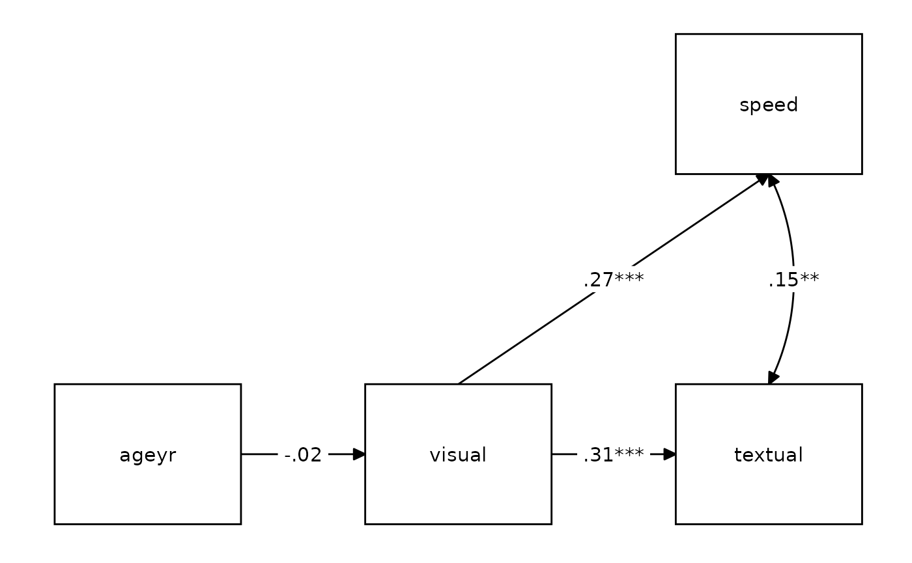

## 1 IV, 2 mediator, 1 DV

``` r
# Define our variables
M <- c("visual", "grade")
DV <- "speed"

# Define our lavaan lists
mediation <- list(speed = M, visual = IV, grade = IV)

# Define indirect object
indirect <- list(IV = IV, M = M, DV = DV)

# Write the model, and check it
model <- write_lavaan(
  mediation = mediation,
  indirect = indirect,
  label = TRUE
)
cat(model)
```

    ## ##################################################
    ## # [-----------Mediations (named paths)-----------]
    ## 
    ## speed ~ visual_speed*visual + grade_speed*grade
    ## visual ~ ageyr_visual*ageyr
    ## grade ~ ageyr_grade*ageyr
    ## 
    ## ##################################################
    ## # [--------Mediations (indirect effects)---------]
    ## 
    ## ageyr_visual_speed := ageyr_visual * visual_speed
    ## ageyr_grade_speed := ageyr_grade * grade_speed

``` r
# Fit and plot
fit <- sem(model, data = data)
nice_lavaanPlot(fit)
```

``` r
nice_tidySEM(fit, layout = indirect)
```

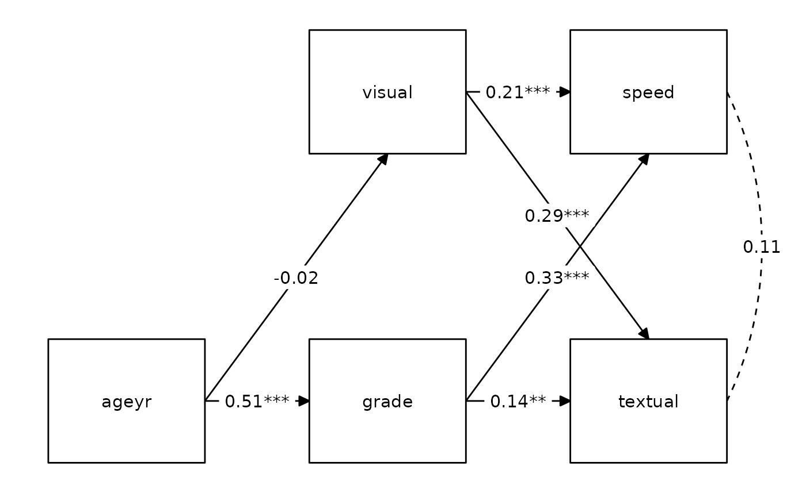

## 1 IV, 2 mediators, 2 DVs

``` r
# Define our variables
DV <- c("speed", "textual")

# Define our lavaan lists
mediation <- list(speed = M, textual = M, visual = IV, grade = IV)

# Define indirect object
indirect <- list(IV = IV, M = M, DV = DV)

# Write the model, and check it
model <- write_lavaan(
  mediation = mediation,
  indirect = indirect,
  label = TRUE
)
cat(model)
```

    ## ##################################################
    ## # [-----------Mediations (named paths)-----------]
    ## 
    ## speed ~ visual_speed*visual + grade_speed*grade
    ## textual ~ visual_textual*visual + grade_textual*grade
    ## visual ~ ageyr_visual*ageyr
    ## grade ~ ageyr_grade*ageyr
    ## 
    ## ##################################################
    ## # [--------Mediations (indirect effects)---------]
    ## 
    ## ageyr_visual_speed := ageyr_visual * visual_speed
    ## ageyr_visual_textual := ageyr_visual * visual_textual
    ## ageyr_grade_speed := ageyr_grade * grade_speed
    ## ageyr_grade_textual := ageyr_grade * grade_textual

``` r
# Fit and plot
fit <- sem(model, data = data)
nice_lavaanPlot(fit)
```

``` r
nice_tidySEM(fit, layout = indirect)
```

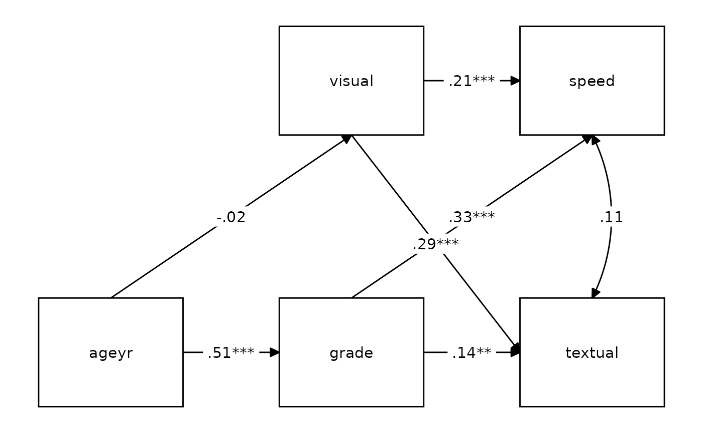

## 2 IVs, 1 mediator, 1 DV

``` r
# Define our variables
IV <- c("sex", "ageyr")
M <- "visual"
DV <- "speed"

# Define our lavaan lists
mediation <- list(speed = M, visual = IV)

# Define indirect object
indirect <- list(M = M, DV = DV, IV = IV)

# Write the model, and check it
model <- write_lavaan(
  mediation = mediation,
  indirect = indirect,
  label = TRUE
)
cat(model)
```

    ## ##################################################
    ## # [-----------Mediations (named paths)-----------]
    ## 
    ## speed ~ visual_speed*visual
    ## visual ~ sex_visual*sex + ageyr_visual*ageyr
    ## 
    ## ##################################################
    ## # [--------Mediations (indirect effects)---------]
    ## 
    ## sex_visual_speed := sex_visual * visual_speed
    ## ageyr_visual_speed := ageyr_visual * visual_speed

``` r
# Fit and plot
fit <- sem(model, data = data)
nice_lavaanPlot(fit)
```

``` r
nice_tidySEM(fit, layout = indirect)
```

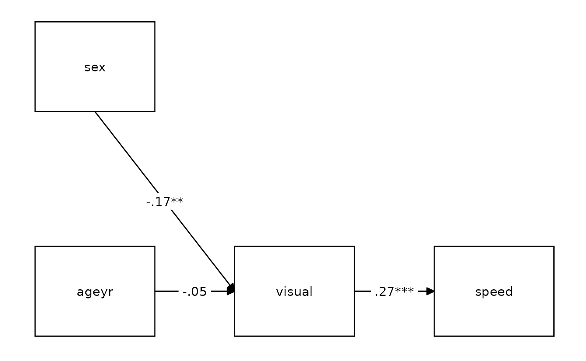

## 2 IVs, 1 mediator, 2 DVs

``` r
# Define our variables
DV <- c("speed", "textual")

# Define our lavaan lists
mediation <- list(speed = M, textual = M, visual = IV)

# Define indirect object
indirect <- list(M = M, DV = DV, IV = IV)

# Write the model, and check it
model <- write_lavaan(
  mediation = mediation,
  indirect = indirect,
  label = TRUE
)
cat(model)
```

    ## ##################################################
    ## # [-----------Mediations (named paths)-----------]
    ## 
    ## speed ~ visual_speed*visual
    ## textual ~ visual_textual*visual
    ## visual ~ sex_visual*sex + ageyr_visual*ageyr
    ## 
    ## ##################################################
    ## # [--------Mediations (indirect effects)---------]
    ## 
    ## sex_visual_speed := sex_visual * visual_speed
    ## sex_visual_textual := sex_visual * visual_textual
    ## ageyr_visual_speed := ageyr_visual * visual_speed
    ## ageyr_visual_textual := ageyr_visual * visual_textual

``` r
# Fit and plot
fit <- sem(model, data = data)
nice_lavaanPlot(fit)
```

``` r
nice_tidySEM(fit, layout = indirect)
```

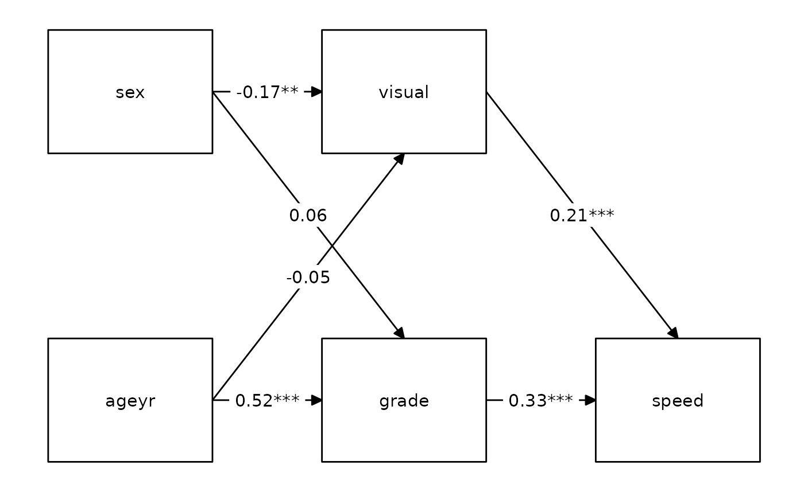

## 2 IVs, 2 mediators, 1 DV

``` r
# Define our variables
M <- c("visual", "grade")
DV <- "speed"

# Define our lavaan lists
mediation <- list(speed = M, visual = IV, grade = IV)

# Define indirect object
indirect <- list(IV = IV, M = M, DV = DV)

# Write the model, and check it
model <- write_lavaan(
  mediation = mediation,
  indirect = indirect,
  label = TRUE
)
cat(model)
```

    ## ##################################################
    ## # [-----------Mediations (named paths)-----------]
    ## 
    ## speed ~ visual_speed*visual + grade_speed*grade
    ## visual ~ sex_visual*sex + ageyr_visual*ageyr
    ## grade ~ sex_grade*sex + ageyr_grade*ageyr
    ## 
    ## ##################################################
    ## # [--------Mediations (indirect effects)---------]
    ## 
    ## sex_visual_speed := sex_visual * visual_speed
    ## ageyr_visual_speed := ageyr_visual * visual_speed
    ## sex_grade_speed := sex_grade * grade_speed
    ## ageyr_grade_speed := ageyr_grade * grade_speed

``` r
# Fit and plot
fit <- sem(model, data = data)
nice_lavaanPlot(fit)
```

``` r
nice_tidySEM(fit, layout = indirect)
```

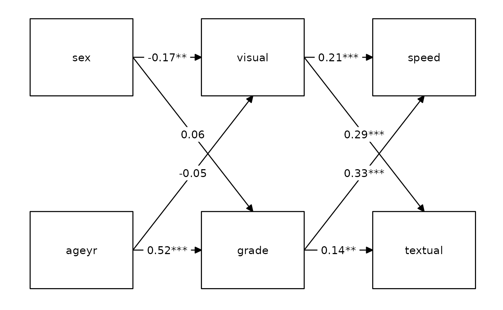

## 2 IVs, 2 mediators, 2 DVs

``` r
# Define our variables
DV <- c("speed", "textual")

# Define our lavaan lists
mediation <- list(speed = M, textual = M, visual = IV, grade = IV)

# Define indirect object
indirect <- list(IV = IV, M = M, DV = DV)

# Write the model, and check it
model <- write_lavaan(
  mediation = mediation,
  indirect = indirect,
  label = TRUE
)
cat(model)
```

    ## ##################################################
    ## # [-----------Mediations (named paths)-----------]
    ## 
    ## speed ~ visual_speed*visual + grade_speed*grade
    ## textual ~ visual_textual*visual + grade_textual*grade
    ## visual ~ sex_visual*sex + ageyr_visual*ageyr
    ## grade ~ sex_grade*sex + ageyr_grade*ageyr
    ## 
    ## ##################################################
    ## # [--------Mediations (indirect effects)---------]
    ## 
    ## sex_visual_speed := sex_visual * visual_speed
    ## sex_visual_textual := sex_visual * visual_textual
    ## ageyr_visual_speed := ageyr_visual * visual_speed
    ## ageyr_visual_textual := ageyr_visual * visual_textual
    ## sex_grade_speed := sex_grade * grade_speed
    ## sex_grade_textual := sex_grade * grade_textual
    ## ageyr_grade_speed := ageyr_grade * grade_speed
    ## ageyr_grade_textual := ageyr_grade * grade_textual

``` r
# Fit and plot
fit <- sem(model, data = data)
nice_lavaanPlot(fit)
```

``` r
nice_tidySEM(fit, layout = indirect)
```

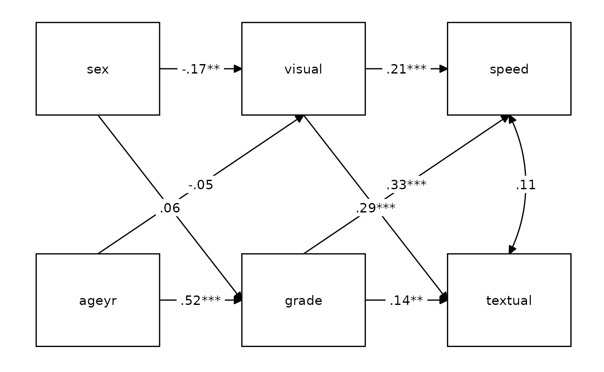

## 3 IVs, 2 mediators, 1 DV

``` r
# Define our variables
IV <- c("sex", "ageyr", "agemo")
DV <- "speed"

# Define our lavaan lists
mediation <- list(speed = M, visual = IV, grade = IV)

# Define indirect object
indirect <- list(IV = IV, M = M, DV = DV)

# Write the model, and check it
model <- write_lavaan(
  mediation = mediation,
  indirect = indirect,
  label = TRUE
)
cat(model)
```

    ## ##################################################
    ## # [-----------Mediations (named paths)-----------]
    ## 
    ## speed ~ visual_speed*visual + grade_speed*grade
    ## visual ~ sex_visual*sex + ageyr_visual*ageyr + agemo_visual*agemo
    ## grade ~ sex_grade*sex + ageyr_grade*ageyr + agemo_grade*agemo
    ## 
    ## ##################################################
    ## # [--------Mediations (indirect effects)---------]
    ## 
    ## sex_visual_speed := sex_visual * visual_speed
    ## ageyr_visual_speed := ageyr_visual * visual_speed
    ## agemo_visual_speed := agemo_visual * visual_speed
    ## sex_grade_speed := sex_grade * grade_speed
    ## ageyr_grade_speed := ageyr_grade * grade_speed
    ## agemo_grade_speed := agemo_grade * grade_speed

``` r
# Fit and plot
fit <- sem(model, data = data)
nice_lavaanPlot(fit)
```

``` r
nice_tidySEM(fit, layout = indirect)
```

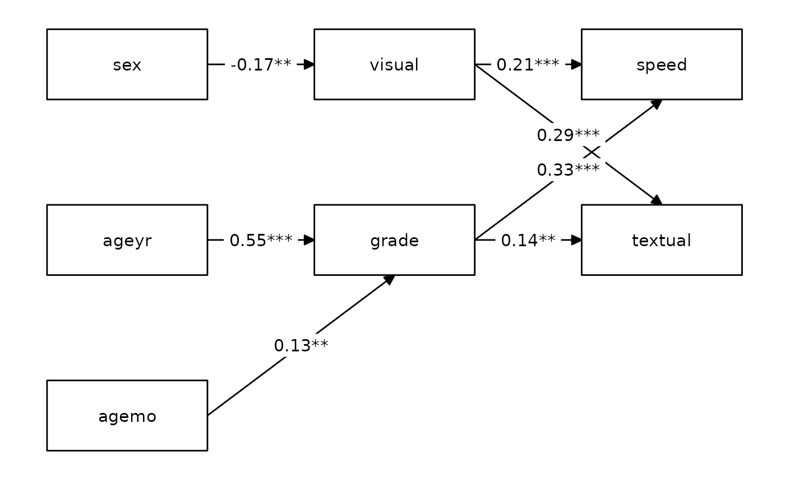

## 3 IVs, 2 mediators, 2 DVs

``` r
# Define our variables
DV <- c("speed", "textual")

# Define our lavaan lists
mediation <- list(speed = M, textual = M, visual = IV, grade = IV)

# Define indirect object
indirect <- list(IV = IV, M = M, DV = DV)

# Write the model, and check it
model <- write_lavaan(
  mediation = mediation,
  indirect = indirect,
  label = TRUE
)
cat(model)
```

    ## ##################################################
    ## # [-----------Mediations (named paths)-----------]
    ## 
    ## speed ~ visual_speed*visual + grade_speed*grade
    ## textual ~ visual_textual*visual + grade_textual*grade
    ## visual ~ sex_visual*sex + ageyr_visual*ageyr + agemo_visual*agemo
    ## grade ~ sex_grade*sex + ageyr_grade*ageyr + agemo_grade*agemo
    ## 
    ## ##################################################
    ## # [--------Mediations (indirect effects)---------]
    ## 
    ## sex_visual_speed := sex_visual * visual_speed
    ## sex_visual_textual := sex_visual * visual_textual
    ## ageyr_visual_speed := ageyr_visual * visual_speed
    ## ageyr_visual_textual := ageyr_visual * visual_textual
    ## agemo_visual_speed := agemo_visual * visual_speed
    ## agemo_visual_textual := agemo_visual * visual_textual
    ## sex_grade_speed := sex_grade * grade_speed
    ## sex_grade_textual := sex_grade * grade_textual
    ## ageyr_grade_speed := ageyr_grade * grade_speed
    ## ageyr_grade_textual := ageyr_grade * grade_textual
    ## agemo_grade_speed := agemo_grade * grade_speed
    ## agemo_grade_textual := agemo_grade * grade_textual

``` r
# Fit and plot
fit <- sem(model, data = data)
nice_lavaanPlot(fit)
```

``` r
nice_tidySEM(fit, layout = indirect, hide_nonsig_edges = TRUE)
```

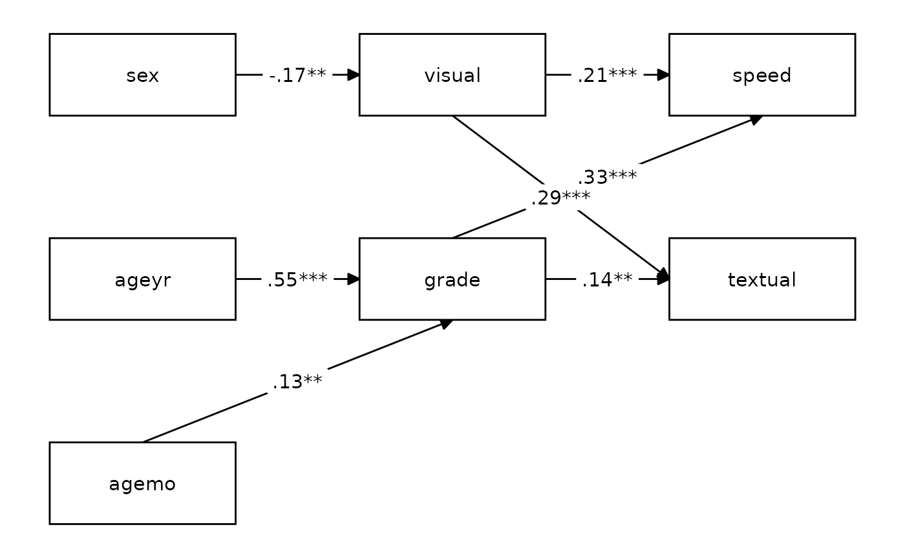

## 6 IVs, 2 mediators, 2 DVs

``` r
# Define our variables
IV <- c("sex", "ageyr", "agemo", "school", "x2", "x3")

# Define our lavaan lists
mediation <- list(speed = M, textual = M, visual = IV, grade = IV)

# Define indirect object
indirect <- list(IV = IV, M = M, DV = DV)

# Write the model, and check it
model <- write_lavaan(
  mediation = mediation,
  indirect = indirect,
  label = TRUE
)
cat(model)
```

    ## ##################################################
    ## # [-----------Mediations (named paths)-----------]
    ## 
    ## speed ~ visual_speed*visual + grade_speed*grade
    ## textual ~ visual_textual*visual + grade_textual*grade
    ## visual ~ sex_visual*sex + ageyr_visual*ageyr + agemo_visual*agemo + school_visual*school + x2_visual*x2 + x3_visual*x3
    ## grade ~ sex_grade*sex + ageyr_grade*ageyr + agemo_grade*agemo + school_grade*school + x2_grade*x2 + x3_grade*x3
    ## 
    ## ##################################################
    ## # [--------Mediations (indirect effects)---------]
    ## 
    ## sex_visual_speed := sex_visual * visual_speed
    ## sex_visual_textual := sex_visual * visual_textual
    ## ageyr_visual_speed := ageyr_visual * visual_speed
    ## ageyr_visual_textual := ageyr_visual * visual_textual
    ## agemo_visual_speed := agemo_visual * visual_speed
    ## agemo_visual_textual := agemo_visual * visual_textual
    ## school_visual_speed := school_visual * visual_speed
    ## school_visual_textual := school_visual * visual_textual
    ## x2_visual_speed := x2_visual * visual_speed
    ## x2_visual_textual := x2_visual * visual_textual
    ## x3_visual_speed := x3_visual * visual_speed
    ## x3_visual_textual := x3_visual * visual_textual
    ## sex_grade_speed := sex_grade * grade_speed
    ## sex_grade_textual := sex_grade * grade_textual
    ## ageyr_grade_speed := ageyr_grade * grade_speed
    ## ageyr_grade_textual := ageyr_grade * grade_textual
    ## agemo_grade_speed := agemo_grade * grade_speed
    ## agemo_grade_textual := agemo_grade * grade_textual
    ## school_grade_speed := school_grade * grade_speed
    ## school_grade_textual := school_grade * grade_textual
    ## x2_grade_speed := x2_grade * grade_speed
    ## x2_grade_textual := x2_grade * grade_textual
    ## x3_grade_speed := x3_grade * grade_speed
    ## x3_grade_textual := x3_grade * grade_textual

``` r
# Fit and plot
fit <- sem(model, data = data)
nice_lavaanPlot(fit)
```

``` r
nice_tidySEM(fit, layout = indirect, hide_nonsig_edges = TRUE)
```

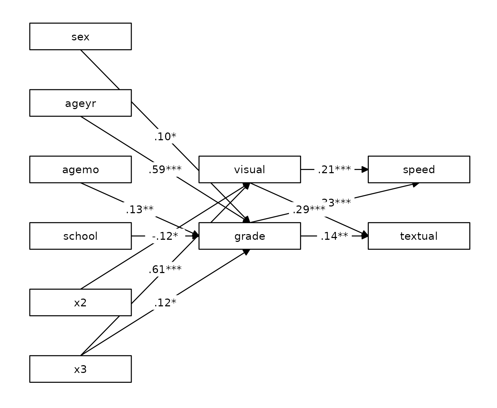

## 6 IVs, 3 mediators, 5 DVs

``` r
# Define our variables
M <- c("visual", "grade", "x8")
DV <- c("speed", "textual", "x4", "x5", "x7")

# Define our lavaan lists
mediation <- list(
  speed = M, textual = M, x4 = M, x5 = M,
  x7 = M, x8 = IV, visual = IV, grade = IV
)

# Define indirect object
indirect <- list(IV = IV, M = M, DV = DV)

# Write the model, and check it
model <- write_lavaan(
  mediation = mediation,
  indirect = indirect,
  label = TRUE
)
cat(model)
```

    ## ##################################################
    ## # [-----------Mediations (named paths)-----------]
    ## 
    ## speed ~ visual_speed*visual + grade_speed*grade + x8_speed*x8
    ## textual ~ visual_textual*visual + grade_textual*grade + x8_textual*x8
    ## x4 ~ visual_x4*visual + grade_x4*grade + x8_x4*x8
    ## x5 ~ visual_x5*visual + grade_x5*grade + x8_x5*x8
    ## x7 ~ visual_x7*visual + grade_x7*grade + x8_x7*x8
    ## x8 ~ sex_x8*sex + ageyr_x8*ageyr + agemo_x8*agemo + school_x8*school + x2_x8*x2 + x3_x8*x3
    ## visual ~ sex_visual*sex + ageyr_visual*ageyr + agemo_visual*agemo + school_visual*school + x2_visual*x2 + x3_visual*x3
    ## grade ~ sex_grade*sex + ageyr_grade*ageyr + agemo_grade*agemo + school_grade*school + x2_grade*x2 + x3_grade*x3
    ## 
    ## ##################################################
    ## # [--------Mediations (indirect effects)---------]
    ## 
    ## sex_visual_speed := sex_visual * visual_speed
    ## sex_visual_textual := sex_visual * visual_textual
    ## sex_visual_x4 := sex_visual * visual_x4
    ## sex_visual_x5 := sex_visual * visual_x5
    ## sex_visual_x7 := sex_visual * visual_x7
    ## ageyr_visual_speed := ageyr_visual * visual_speed
    ## ageyr_visual_textual := ageyr_visual * visual_textual
    ## ageyr_visual_x4 := ageyr_visual * visual_x4
    ## ageyr_visual_x5 := ageyr_visual * visual_x5
    ## ageyr_visual_x7 := ageyr_visual * visual_x7
    ## agemo_visual_speed := agemo_visual * visual_speed
    ## agemo_visual_textual := agemo_visual * visual_textual
    ## agemo_visual_x4 := agemo_visual * visual_x4
    ## agemo_visual_x5 := agemo_visual * visual_x5
    ## agemo_visual_x7 := agemo_visual * visual_x7
    ## school_visual_speed := school_visual * visual_speed
    ## school_visual_textual := school_visual * visual_textual
    ## school_visual_x4 := school_visual * visual_x4
    ## school_visual_x5 := school_visual * visual_x5
    ## school_visual_x7 := school_visual * visual_x7
    ## x2_visual_speed := x2_visual * visual_speed
    ## x2_visual_textual := x2_visual * visual_textual
    ## x2_visual_x4 := x2_visual * visual_x4
    ## x2_visual_x5 := x2_visual * visual_x5
    ## x2_visual_x7 := x2_visual * visual_x7
    ## x3_visual_speed := x3_visual * visual_speed
    ## x3_visual_textual := x3_visual * visual_textual
    ## x3_visual_x4 := x3_visual * visual_x4
    ## x3_visual_x5 := x3_visual * visual_x5
    ## x3_visual_x7 := x3_visual * visual_x7
    ## sex_grade_speed := sex_grade * grade_speed
    ## sex_grade_textual := sex_grade * grade_textual
    ## sex_grade_x4 := sex_grade * grade_x4
    ## sex_grade_x5 := sex_grade * grade_x5
    ## sex_grade_x7 := sex_grade * grade_x7
    ## ageyr_grade_speed := ageyr_grade * grade_speed
    ## ageyr_grade_textual := ageyr_grade * grade_textual
    ## ageyr_grade_x4 := ageyr_grade * grade_x4
    ## ageyr_grade_x5 := ageyr_grade * grade_x5
    ## ageyr_grade_x7 := ageyr_grade * grade_x7
    ## agemo_grade_speed := agemo_grade * grade_speed
    ## agemo_grade_textual := agemo_grade * grade_textual
    ## agemo_grade_x4 := agemo_grade * grade_x4
    ## agemo_grade_x5 := agemo_grade * grade_x5
    ## agemo_grade_x7 := agemo_grade * grade_x7
    ## school_grade_speed := school_grade * grade_speed
    ## school_grade_textual := school_grade * grade_textual
    ## school_grade_x4 := school_grade * grade_x4
    ## school_grade_x5 := school_grade * grade_x5
    ## school_grade_x7 := school_grade * grade_x7
    ## x2_grade_speed := x2_grade * grade_speed
    ## x2_grade_textual := x2_grade * grade_textual
    ## x2_grade_x4 := x2_grade * grade_x4
    ## x2_grade_x5 := x2_grade * grade_x5
    ## x2_grade_x7 := x2_grade * grade_x7
    ## x3_grade_speed := x3_grade * grade_speed
    ## x3_grade_textual := x3_grade * grade_textual
    ## x3_grade_x4 := x3_grade * grade_x4
    ## x3_grade_x5 := x3_grade * grade_x5
    ## x3_grade_x7 := x3_grade * grade_x7
    ## sex_x8_speed := sex_x8 * x8_speed
    ## sex_x8_textual := sex_x8 * x8_textual
    ## sex_x8_x4 := sex_x8 * x8_x4
    ## sex_x8_x5 := sex_x8 * x8_x5
    ## sex_x8_x7 := sex_x8 * x8_x7
    ## ageyr_x8_speed := ageyr_x8 * x8_speed
    ## ageyr_x8_textual := ageyr_x8 * x8_textual
    ## ageyr_x8_x4 := ageyr_x8 * x8_x4
    ## ageyr_x8_x5 := ageyr_x8 * x8_x5
    ## ageyr_x8_x7 := ageyr_x8 * x8_x7
    ## agemo_x8_speed := agemo_x8 * x8_speed
    ## agemo_x8_textual := agemo_x8 * x8_textual
    ## agemo_x8_x4 := agemo_x8 * x8_x4
    ## agemo_x8_x5 := agemo_x8 * x8_x5
    ## agemo_x8_x7 := agemo_x8 * x8_x7
    ## school_x8_speed := school_x8 * x8_speed
    ## school_x8_textual := school_x8 * x8_textual
    ## school_x8_x4 := school_x8 * x8_x4
    ## school_x8_x5 := school_x8 * x8_x5
    ## school_x8_x7 := school_x8 * x8_x7
    ## x2_x8_speed := x2_x8 * x8_speed
    ## x2_x8_textual := x2_x8 * x8_textual
    ## x2_x8_x4 := x2_x8 * x8_x4
    ## x2_x8_x5 := x2_x8 * x8_x5
    ## x2_x8_x7 := x2_x8 * x8_x7
    ## x3_x8_speed := x3_x8 * x8_speed
    ## x3_x8_textual := x3_x8 * x8_textual
    ## x3_x8_x4 := x3_x8 * x8_x4
    ## x3_x8_x5 := x3_x8 * x8_x5
    ## x3_x8_x7 := x3_x8 * x8_x7

``` r
# Fit and plot
fit <- sem(model, data = data)
nice_lavaanPlot(fit)
```

``` r
labels <- list(
  sex = "Sex",
  ageyr = "Age (year)",
  agemo = "Age (month)",
  school = "School",
  x2 = "Item 2",
  x3 = "Item 3",
  visual = "Visual",
  grade = "Grade",
  x8 = "Item 8",
  speed = "Speed",
  textual = "Textual",
  x4 = "Item 4",
  x5 = "Item 5",
  x7 = "Item 7"
)

nice_tidySEM(fit, layout = indirect, hide_nonsig_edges = TRUE, label = labels)
```

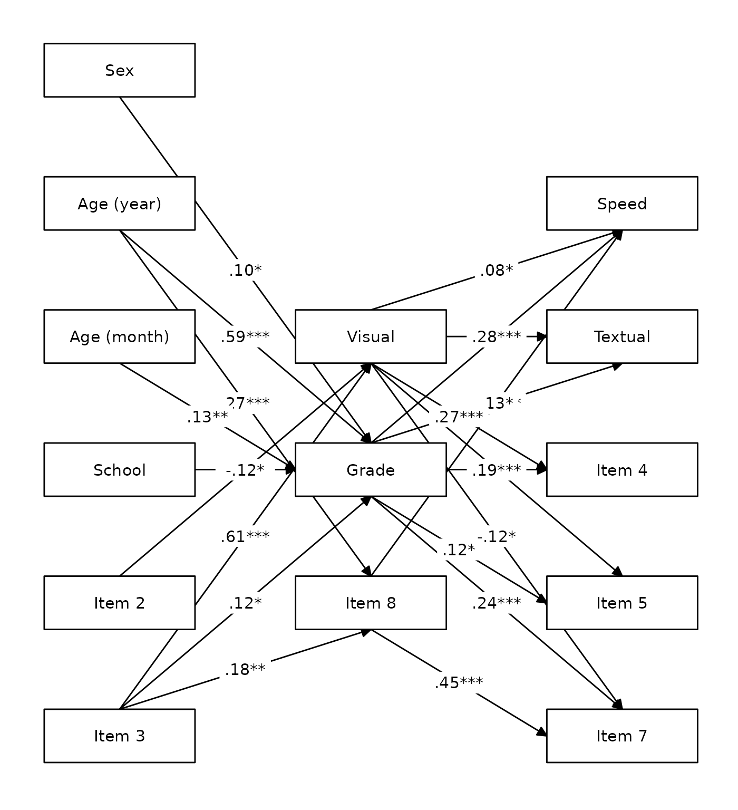

Etc.

## Other scenarios

If you experience any issues with other scenarios, please open a [GitHub
issue](https://github.com/rempsyc/lavaanExtra/issues) with your example,
and I will try to adapt the function to support that case. Thank you!
