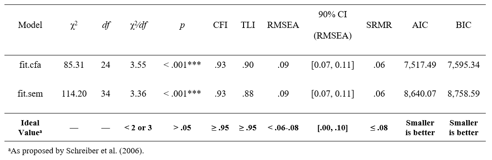
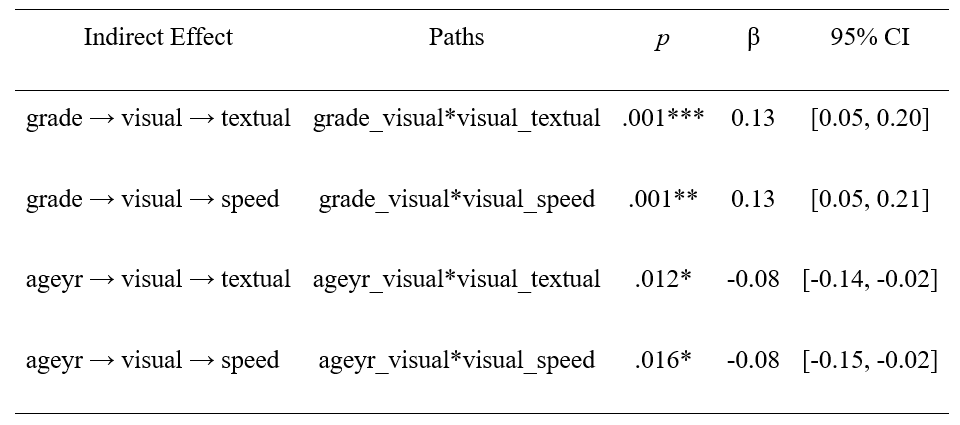

# Summary

{lavaanExtra} is an R package that offers an alternative, vector-based syntax to 
package {lavaan}, as well as other convenience functions such as naming paths 
and defining indirect effects automatically. It also offers convenience formatting 
optimized for publication and script sharing workflows.

# Statement of need

{lavaan} [@lavaanPackage] is a very popular R package for structural equation 
modeling (SEM). {lavaan} requires familiarizing oneself with a specific syntax
to define latent variables, regressions, covariances, indirect effects, and so
on.

{lavaanExtra} does mainly two things. First, it offers an alternative, 
code-efficient syntax. Second, it facilitates the analysis-to-publication
workflow by providing publication-ready tables and figures (following the 
style of the American Psychological Association, APA).

## Usage

There is a single function at the center of the proposed alternative syntax,
`write_lavaan()`. The idea behind `write_lavaan()` is to define individual 
components (regressions, covariances, latent variables, etc.), provide them to 
the function, and have it write the `lavaan` model, so the user does not have to
worry about making typos in the specific symbols required for each aspect of 
the model.

There are several benefits to this approach. Some `lavaan` models can become
very large. By defining the entire model every time, such as is typical with
{lavaan} users, not only do we break the DRY (Don't Repeat Yourself) principle, 
but our scripts can also become long and unwieldy. This problem gets worse in 
the scenario where we want to compare several variations of the same general 
model. `write_lavaan()` allows the user to reuse code components, say, only 
the latent variables, for future models.

This aspect also allows better control over the user's code. If the user makes 
a mistake in one of say five SEM models definition, the user will have to 
change it at all five places within the script. With `write_lavaan()`, the user 
only needs to change it once, at the relevant location, and it will update 
future occurrences automatically since it relies on reusable components.

The vector-based approach also allows the use of functions to define components.
For example, if all scale items are named consistently, say `x1` to `x50`, one 
can use `paste0("x", 1:50)` instead of typing all the items by hand and risk 
making mistakes.

Another issue with `lavaan` models is readability of the code defining the model. 
One can go in lengths to make it pretty, but not everyone does, and many people
do not use the same strategies to organize the information from the model. With
`write_lavaan()`, not only is the model information standardized, but it is 
also neatly divided in clear and useful categories.

Finally, for beginners, it can be difficult to remember the correct `lavaan` 
symbols for each specific operation. `write_lavaan()` uses intuitive names to
convert the information to the correct symbols, meaning the user does not have 
to rely on memory as much. Even for people familiar with `lavaan` syntax, this 
approach can save time. The function also saves time by offering the possibility 
to define the named paths automatically, with clear and intuitive names.

I provide a simple Confirmatory Factor Analysis (CFA) example below, where the 
latent variables `visual`, `textual`, and `speed` are defined by items 1 to 9. 
We can then use the `cat()` function on the resulting object (of type character) 
to read it in the traditional way and make sure we have not made any mistake.

```{r, warning=F, message=F, echo=F}
library(lavaanExtra)
library(lavaan)
library(tidySEM)
```

```{r}
library(lavaanExtra)

latent <- list(visual = paste0("x", 1:3),
               textual = paste0("x", 4:6),
               speed = paste0("x", 7:9))

model.cfa <- write_lavaan(latent = latent)
cat(model.cfa)
```

Should we want to use these latent variables in a full SEM model, we do not
need to define the latent variables again, only the new components. With the
`lavaanExtra` syntax, when defining our lists of components, we can think of 
the `=` sign as "predicted by", a bit like `~` for regression. There is
an exception to this for the `indirect` object, which also allows specifying 
our variables directly instead. When such is the case, `write_lavaan()` will
define all indirect paths automatically.

```{r}
DV <- c("textual", "speed")
M <- "visual"
IV <- c("grade", "ageyr")

mediation <- list(speed = M, textual = M, visual = IV)
regression <- list(speed = IV, textual = IV)
covariance <- list(speed = "textual", ageyr = "grade", x4 = c("x5", "x6"))
indirect <- list(IV = IV, M = M, DV = DV)

model.sem <- write_lavaan(mediation = mediation, 
                          regression = regression, 
                          covariance = covariance, 
                          indirect = indirect, 
                          latent = latent, 
                          label = TRUE)
cat(model.sem)
```

## Tables

The most popular {lavaanExtra} function for tables is `nice_fit()`, which 
extracts only some of the most popular fit indices and organize them such
that it is easy to compare models. There is an option to format the table 
as an APA {flextable} [@flextablePackage], through the {rempsyc} package 
[@rempsycPackage], using option `nice_table = TRUE`. This `flextable` object 
can then be easily exported to Microsoft Word. Below we fit our two earlier
models and feed them to `nice_fit()` as a named list:

```{r}
library(lavaan)
fit.cfa <- cfa(model.cfa, data = HolzingerSwineford1939)
fit.sem <- sem(model.sem, data = HolzingerSwineford1939)

list.mods <- list(fit.cfa = fit.cfa, fit.sem = fit.sem)
fit_table <- nice_fit(list.mods, nice_table = TRUE)
```

```{r, eval=F}
fit_table
```



The table can then be saved to word simply using `flextable::save_as_docx()` on
the resulting `flextable` object. 

```{r, eval=F}
flextable::save_as_docx(fit_table, path = "fit_table.docx")
```

It is similarly possible to prepare APA tables in Word with the regression
coefficients (`lavaan_reg()`), covariances (`lavaan_cov()`), correlations
(`lavaan_cor()`), or indirect effects (`lavaan_ind()`). For example, for 
indirect effects:

```{r, include=F, eval=F}
x <- lavaan_ind(fit.sem, nice_table = TRUE)
flextable::save_as_docx(x, path = "ind_table.docx")
```

```{r, eval=F}
lavaan_ind(fit.sem, nice_table = TRUE)
```



## Figures

There are several packages designed to plot SEM models, but few that people
consider satisfying or sufficiently good for publication. There are two
packages that stand out however, {lavaanPlot} [@lavaanPlotPackage] and 
{tidySEM} [@tidySEMPackage]. Yet, even for those excellent packages, most 
people do not view them as publication-ready or at least optimized in the best 
possible way.

This is what `nice_lavaanPlot` and `nice_tidySEM` aim to correct. Let's 
compare the default `lavaanPlot()` and `nice_lavaanPlot()` outputs 
side-by-side for demonstration purposes.

```{r nice_lavaanPlot}
lavaanPlot::lavaanPlot(fit.sem)
# This is temporarily commented out because it is generating a bug on my home
# computer. I will have to reknit the document from my work laptop.

nice_lavaanPlot(fit.sem)
```

As these figures demonstrate, `nice_lavaanPlot()` has several elements
frequently requested by researchers (especially in psychology): (a)
a horizontal, rather than vertical, layout; (b) the coefficients
appear by default (but only significant ones); (c) significance
stars; and (d) the use of a sans serif font (as required by APA 
style for figures).

Even so, `nice_lavaanPlot` is not perfectly optimal for publication, for 
example for the use of curved lines, which many researchers dislike. 
Nonetheless, it will still yield excellent and satisfying results for a 
quick and easy check.

The best option for publication then is `nice_tidySEM`. Let's first
look at the default output of the base `tidySEM::graph_sem()` for 
reference.

```{r graph_sem, fig.width=14, fig.height=5, message=FALSE, warning=FALSE}
tidySEM::graph_sem(fit.sem)
```

The author of the {tidySEM} package notes that

> This uses a default layout, provided by the `igraph` package. However, 
the node placement is not very aesthetically pleasing. One of the areas 
where tidySEM really excels is customization. [@tidySEMWebsite]

In this sense, most of the time, both `tidySEM` and `nice_tidySEM` will 
need a layout in order to yield the best result. One of the benefits of
`nice_tidySEM` is that when our model is simply made of three "levels": 
independent variables, mediators, and dependent variables (e.g., for a 
path analysis, or if we do not want to draw the items for a full SEM),
it is possible to automatically specify a proper layout by simply 
feeding it the `indirect` object that we created earlier.

```{r nice_tidySEM, fig.width=8, fig.height=4, message=FALSE}
nice_tidySEM(fit.sem, layout = indirect)
```

For the time being, `nice_tidySEM` only supports this three-level 
automatic layout, but designs with more levels are in the works. In the 
meantime, when the model is more complex (or that we want to include items), 
it is necessary to specify the layout manually using a matrix or data frame, 
which allows fine-grained control over the generated figure.

```{r}
mylayout <- data.frame(
  IV = c("x1", "grade", "", "ageyr", ""),
  M = c("x2", "", "visual", "", ""),
  DV = c("x3", "textual", "", "speed", "x9"),
  DV.items = c(paste0("x", 4:8)))
as.matrix(mylayout)
```

```{r nice_tidySEM2, fig.width=8, fig.height=5}
nice_tidySEM(fit.sem, layout = mylayout, label_location = 0.70)
```

If the figure is still not sufficiently satisfying, it is possible to store
the output as a `tidy_sem` object (by using `plot = FALSE`), which can then 
be modified according to regular `tidySEM` syntax. This can be useful to
fine-tune and finalize the figure.

```{r nice_tidySEM3, fig.width=8, fig.height=6}
x <- nice_tidySEM(fit.sem, layout = mylayout, label_location = 0.65, 
                  reduce_items = c(x = 0.4, y = 0.2), plot = FALSE)
from <- x$edges$from
to <- x$edges$to
x$edges[from == "grade" & to == "speed", "curvature"] <- 40
x$edges[from == "ageyr" & to == "textual", "curvature"] <- -40
plot(x)
```

The resulting figure can be saved using `ggplot2::ggsave()` [@ggplot2Package]:

```{r, eval=FALSE}
ggplot2::ggsave("my_semPlot.pdf", width = 8, height = 6)
```

Other differences between {tidySEM} and `nice_tidySEM()` are that: (a) the
latter displays standardized coefficients by default (but unstandardized
coefficients can be specified with `est_std = FALSE`), (b) if using 
standardized coefficients, the leading zero is omitted (as per APA 
requirements); (c) does not plot the variances by default, (d) uses
full double-headed arrows instead of dashed lines with no arrows for
covariances, (e) has further arguments for easy customization (e.g.,
`reduce_items`), and (f) allows defining an automatic layout in specific 
cases (as described earlier).

Finally, the base function, `tidySEM::graph_sem()`, is difficult 
to customize in depth. For the aesthetics of `nice_tidySEM()`, 
for example, we need to rely instead on the {tidySEM}'s `prepare_graph()`,
`edit_graph()`, and numerous conditional formatting functions. In contrast 
to `nice_tidySEM()`, these `tidySEM` functions act more like a grammar of 
SEM plotting, akin to the popular grammar of graphics, {ggplot2} 
[@ggplot2Package]. This provides great flexibility, but for the occasional 
user, also comes with an additional burden, as users may for example need 
to skim through almost 400 undocumented functions, should they want to 
conditionally edit the resulting `tidy_sem` object.

# Availability

The {lavaanExtra} package is licensed under the MIT License. It is available on 
CRAN, and can be installed using `install.packages("lavaanExtra")`. The full 
tutorial website can be accessed at: https://lavaanExtra.remi-theriault.com/. 
All code is open-source and hosted on GitHub, and bugs can be reported at 
https://github.com/rempsyc/lavaanExtra/issues/.

# Acknowledgements

I would like to thank Hugues Leduc, Jany St-Cyr, Andreea Gavrila, Patrick 
Coulombe, Jay Olson, Charles-Étienne Lavoie, and Björn Büdenbender for 
statistical or technical advice that helped inform some functions of this 
package and/or useful feedback on this manuscript. I would also like to 
acknowledge funding from the Social Sciences and Humanities Research Council of 
Canada.

# References
