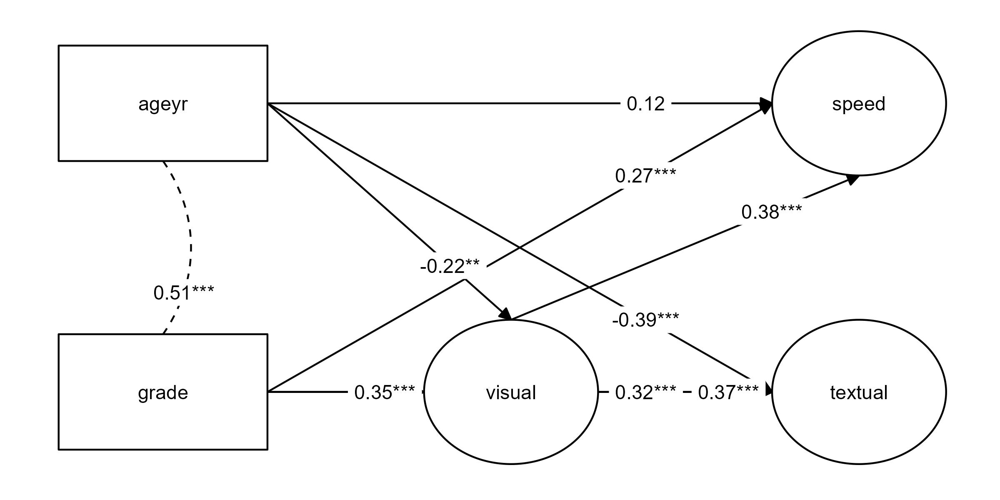

# Summary

{lavaanExtra} is an R package that offers an alternative, vector-based syntax to 
package {lavaan}, as well as other convenience functions such as naming paths 
and defining indirect links automatically. It also offers convenience formatting 
optimized for a publication and script sharing workflow.

# Statement of need

{lavaan} [@lavaanPackage] is a very popular R package for structural equation 
modeling (SEM). {lavaan} requires familiarizing oneself with a specific syntax
to define latent variables, regressions, covariances, indirect effects, and so
on.

{lavaanExtra} does mainly two things. First, it offers an alternative, 
code-efficient syntax. Second, it facilitates the analysis-to-publication
workflow by providing publication-ready tables and figures.

# Alternative Syntax

There is a single function at the center of the proposed alternative syntax,
`write_lavaan()`. The idea behind `write_lavaan()` is to define individual 
components (regressions, covariances, latent variables, etc.), provide them to 
the function, and have it write the lavaan model, so the user does not have to
worry about making typos in the specific symbols required for each aspect of 
the model.

There are several benefits to this approach. Some lavaan models can become
very large. By defining the entire model every time, not only do we break the 
DRY (Don't Repeat Yourself) principle, but our scripts can also become long and 
unwieldy. This problem gets worse in the scenario where we want to compare 
several variations of the same general model. `write_lavaan()` allows the user 
to reuse code components, say, only the latent variables, for future models.

This aspect also allows better control over the user's code. If the user makes 
a mistake in one of say five SEM models definition, the user will have to 
change it at all five places within the script. With `write_lavaan()`, the user 
only needs to change it once, at the relevant location, and it will update 
future occurrences automatically since it relies on reusable components.

The vector-based approach also allows the use of functions to define components.
For example, if all scale items are named consistently, say `x1` to `x50`, one 
can use `paste0("x", 1:50)` instead of typing all the items by hand and risk 
making mistakes.

Another issue with lavaan models is readability of the code defining the model. 
One can go in lengths to make it pretty, but not everyone does, and the model 
formatting is certaintly not standardized. With `write_lavaan()`, not only is 
the model standardized, but it is also neatly divided in clear and useful 
categories.

Finally, for beginners, it can be difficult to remember the correct lavaan 
symbols for each specific operation. `write_lavaan()` uses intuitive names to
convert the information to the correct symbols, meaning the user does not have 
to rely on memory as much. Even for people familiar with lavaan syntax, this 
approach can save time. The function also saves time by offering the possibility 
to define the named paths automatically, with clear and intuitive names.

I provide a simple CFA example below, where the latent variables `visual`,
`textual`, and `speed` are defined by items 1 to 9. We can then use the `cat()`
function on the resulting object (of type character) to read it in the
traditional way and make sure we have not made any mistake.


```r
library(lavaanExtra)

latent <- list(visual = paste0("x", 1:3),
               textual = paste0("x", 4:6),
               speed = paste0("x", 7:9))

model.cfa <- write_lavaan(latent = latent)
cat(model.cfa)
```

```
## ##################################################
## # [-----Latent variables (measurement model)-----]
## 
## visual =~ x1 + x2 + x3
## textual =~ x4 + x5 + x6
## speed =~ x7 + x8 + x9
```

Should we want to use these latent variables in a full SEM model, we do not
need to define the latent variables again, only the new components. In the 
example below, the dependent variables DV (`speed` and `textual`) are mediated 
by the mediator M (`visual`) and predicted by the independent variables IV 
(`ageyr` and `grade`). Similarly, we specify covariances between the DVs and 
IVs, and in this case our indirect effects can be determined automatically.


```r
DV <- c("speed", "textual")
M <- "visual"
IV <- c("ageyr", "grade")

mediation <- list(speed = M, textual = M, visual = IV)
regression <- list(speed = IV, textual = IV)
covariance <- list(speed = "textual", ageyr = "grade")
indirect <- list(IV = IV, M = M, DV = DV)

model.sem <- write_lavaan(mediation, regression, covariance, 
                          indirect, latent, label = TRUE)
cat(model.sem)
```

```
## ##################################################
## # [-----Latent variables (measurement model)-----]
## 
## visual =~ x1 + x2 + x3
## textual =~ x4 + x5 + x6
## speed =~ x7 + x8 + x9
## 
## ##################################################
## # [-----------Mediations (named paths)-----------]
## 
## speed ~ visual_speed*visual
## textual ~ visual_textual*visual
## visual ~ ageyr_visual*ageyr + grade_visual*grade
## 
## ##################################################
## # [---------Regressions (Direct effects)---------]
## 
## speed ~ ageyr + grade
## textual ~ ageyr + grade
## 
## ##################################################
## # [------------------Covariances-----------------]
## 
## speed ~~ textual
## ageyr ~~ grade
## 
## ##################################################
## # [--------Mediations (indirect effects)---------]
## 
## ageyr_visual_speed := ageyr_visual * visual_speed
## ageyr_visual_textual := ageyr_visual * visual_textual
## grade_visual_speed := grade_visual * visual_speed
## grade_visual_textual := grade_visual * visual_textual
```

# Tables

The most popular {lavaanExtra} function for tables is `nice_fit()`, which 
extracts only some of the most popular fit indices, compares them among models 
automatically, and formats the output as an APA-style {flextable} 
[@flextablePackage], through the {rempsyc} package [@rempsycPackage]. Below we 
fit our two earlier models and feed them to `nice_fit()` as a named list:


```r
library(lavaan)
fit.cfa <- cfa(model.cfa, data = HolzingerSwineford1939)
fit.sem <- sem(model.sem, data = HolzingerSwineford1939)

fit_table <- nice_fit(dplyr::lst(fit.cfa, fit.sem), nice_table = TRUE)
```


```r
fit_table
```


The table can then be saved to word simply using `flextable::save_as_docx()` on
the resulting `flextable` object. 


```r
flextable::save_as_docx(fit_table, path = "fit_table.docx")
```

It is similarly possible to prepare APA tables in Word with the regression
coefficients (`lavaan_reg()`), covariances (`lavaan_cov()`), or indirect effects 
(`lavaan_ind()`). For example, for indirect effects:


```r
x <- lavaan_ind(fit.sem, nice_table = TRUE)
flextable::save_as_docx(x, path = "ind_table.docx")
```


```r
lavaan_ind(fit.sem, nice_table = TRUE)
```


# Figures

There are several packages designed to plot SEM models, but few that people
consider satisfying or sufficiently good for publication. There are two
packages that stand out, however, {lavaanPlot} [@lavaanPlotPackage] and 
{tidySEM} [@tidySEMPackage]. Yet, even for those excellent packages, most 
people do not view them as publication-ready or at least optimized in the best 
possible way.

This is what `nice_lavaanPlot` and `nice_tidySEM` aim to correct. 
`nice_lavaanPlot` is not optimal for publications but will yield excellent 
results for a quick and easy check.


```r
nice_lavaanPlot(fit.sem)
```


The best option for publication is `nice_tidySEM`. When our model is simply
made of three "levels": independent variables, mediators, and dependent 
variables, or that we do not want to draw the items, we can specify the layout 
by simply feeding it the `indirect` object that we created earlier.


```r
nice_tidySEM(fit.sem, layout = indirect, label_location = 0.75)
```




However, when the model is more complex (or that we want to include items), it 
is necessary to specify the layout manually using a matrix or data frame, which
allows a fine-grained control over the generated figure.


```r
mylayout <- data.frame(
  IV = c("", "x1", "grade", "", "ageyr", "", ""),
  M = c("", "x2", "", "visual", "", "", ""),
  DV = c("", "x3", "textual", "", "speed", "", ""),
  DV.items = c(paste0("x", 4:6), "", paste0("x", 7:9)))
as.matrix(mylayout)
```

```
##      IV      M        DV        DV.items
## [1,] ""      ""       ""        "x4"    
## [2,] "x1"    "x2"     "x3"      "x5"    
## [3,] "grade" ""       "textual" "x6"    
## [4,] ""      "visual" ""        ""      
## [5,] "ageyr" ""       "speed"   "x7"    
## [6,] ""      ""       ""        "x8"    
## [7,] ""      ""       ""        "x9"
```


```r
nice_tidySEM(fit.sem, layout = mylayout)
```


This figure can be saved using `ggplot2::ggsave()` [@ggplot2Package].


```r
ggplot2::ggsave("my_semPlot.pdf", width = 7, height = 4)
```

# Availability

The {lavaanExtra} package is licensed under the MIT License. It is available on 
CRAN, and can be installed using `install.packages("lavaanExtra")`. The full 
tutorial website can be accessed at: https://lavaanExtra.remi-theriault.com/. 
All code is open-source and hosted on GitHub, and bugs can be reported at 
https://github.com/rempsyc/lavaanExtra/issues/.

# Acknowledgements

I would like to thank Hugues Leduc, Charles-Étienne Lavoie, Jany St-Cyr, and 
Andreea Gavrila for statistical or technical advice that helped inform some 
functions of this package and/or useful feedback on this manuscript. I would 
also like to acknowledge funding from the Social Sciences and Humanities 
Research Council of Canada.

# References
