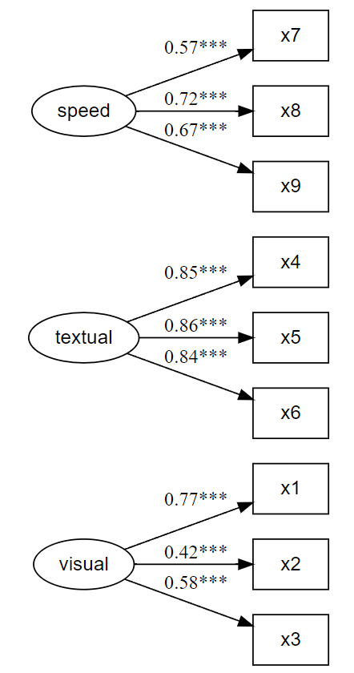

# Fit and plot CFA simultaneously

Prints and saves CFA fit, as well as plots CFA factor loadings,
simultaneously.

## Usage

``` r
cfa_fit_plot(
  model,
  data,
  covs = FALSE,
  estimator = "MLR",
  remove.items = "",
  print = TRUE,
  save.as.pdf = FALSE,
  file.name,
  ...
)
```

## Arguments

- model:

  CFA model to fit.

- data:

  Data set on which to fit the CFA model.

- covs:

  Logical, whether to include covariances on the lavaan plot.

- estimator:

  What estimator to use for the CFA.

- remove.items:

  Optional, if one wants to remove items from the CFA model without
  having to redefine it completely again.

- print:

  Logical, whether to print model summary to console.

- save.as.pdf:

  Logical, whether to save as PDF for a high-resolution, scalable vector
  graphic quality plot. Defaults to saving to the "/model" subfolder of
  the working directory. If it doesn't exist, it creates it. Then
  automatically open the created PDF in the default browser. Defaults to
  false.

- file.name:

  Optional (when `save.as.pdf` is set to `TRUE`), if one wants something
  different than the default file name. It saves to pdf per default, so
  the .pdf extension should not be specified as it will add it
  automatically.

- ...:

  Arguments to be passed to function
  [lavaan::cfa](https://rdrr.io/pkg/lavaan/man/cfa.html).

## Value

The function returns a `lavaan` fit object. However, it also: prints a
summary of the `lavaan` fit object to the console, and; prints a
`lavaanPlot` of the `lavaan` fit object.

## Illustrations



## Examples

``` r
x <- paste0("x", 1:9)
(latent <- list(
  visual = x[1:3],
  textual = x[4:6],
  speed = x[7:9]
))
#> $visual
#> [1] "x1" "x2" "x3"
#> 
#> $textual
#> [1] "x4" "x5" "x6"
#> 
#> $speed
#> [1] "x7" "x8" "x9"
#> 

HS.model <- write_lavaan(latent = latent)
cat(HS.model)
#> ##################################################
#> # [-----Latent variables (measurement model)-----]
#> 
#> visual =~ x1 + x2 + x3
#> textual =~ x4 + x5 + x6
#> speed =~ x7 + x8 + x9
#> 

library(lavaan)
#> This is lavaan 0.6-20
#> lavaan is FREE software! Please report any bugs.
fit <- cfa_fit_plot(HS.model, HolzingerSwineford1939)
#> lavaan 0.6-20 ended normally after 35 iterations
#> 
#>   Estimator                                         ML
#>   Optimization method                           NLMINB
#>   Number of model parameters                        21
#> 
#>   Number of observations                           301
#> 
#> Model Test User Model:
#>                                               Standard      Scaled
#>   Test Statistic                                85.306      87.132
#>   Degrees of freedom                                24          24
#>   P-value (Chi-square)                           0.000       0.000
#>   Scaling correction factor                                  0.979
#>     Yuan-Bentler correction (Mplus variant)                       
#> 
#> Model Test Baseline Model:
#> 
#>   Test statistic                               918.852     880.082
#>   Degrees of freedom                                36          36
#>   P-value                                        0.000       0.000
#>   Scaling correction factor                                  1.044
#> 
#> User Model versus Baseline Model:
#> 
#>   Comparative Fit Index (CFI)                    0.931       0.925
#>   Tucker-Lewis Index (TLI)                       0.896       0.888
#>                                                                   
#>   Robust Comparative Fit Index (CFI)                         0.930
#>   Robust Tucker-Lewis Index (TLI)                            0.895
#> 
#> Loglikelihood and Information Criteria:
#> 
#>   Loglikelihood user model (H0)              -3737.745   -3737.745
#>   Scaling correction factor                                  1.133
#>       for the MLR correction                                      
#>   Loglikelihood unrestricted model (H1)      -3695.092   -3695.092
#>   Scaling correction factor                                  1.051
#>       for the MLR correction                                      
#>                                                                   
#>   Akaike (AIC)                                7517.490    7517.490
#>   Bayesian (BIC)                              7595.339    7595.339
#>   Sample-size adjusted Bayesian (SABIC)       7528.739    7528.739
#> 
#> Root Mean Square Error of Approximation:
#> 
#>   RMSEA                                          0.092       0.093
#>   90 Percent confidence interval - lower         0.071       0.073
#>   90 Percent confidence interval - upper         0.114       0.115
#>   P-value H_0: RMSEA <= 0.050                    0.001       0.001
#>   P-value H_0: RMSEA >= 0.080                    0.840       0.862
#>                                                                   
#>   Robust RMSEA                                               0.092
#>   90 Percent confidence interval - lower                     0.072
#>   90 Percent confidence interval - upper                     0.114
#>   P-value H_0: Robust RMSEA <= 0.050                         0.001
#>   P-value H_0: Robust RMSEA >= 0.080                         0.849
#> 
#> Standardized Root Mean Square Residual:
#> 
#>   SRMR                                           0.065       0.065
#> 
#> Parameter Estimates:
#> 
#>   Standard errors                             Sandwich
#>   Information bread                           Observed
#>   Observed information based on                Hessian
#> 
#> Latent Variables:
#>                    Estimate  Std.Err  z-value  P(>|z|)   Std.lv  Std.all
#>   visual =~                                                             
#>     x1                1.000                               0.900    0.772
#>     x2                0.554    0.132    4.191    0.000    0.498    0.424
#>     x3                0.729    0.141    5.170    0.000    0.656    0.581
#>   textual =~                                                            
#>     x4                1.000                               0.990    0.852
#>     x5                1.113    0.066   16.946    0.000    1.102    0.855
#>     x6                0.926    0.061   15.089    0.000    0.917    0.838
#>   speed =~                                                              
#>     x7                1.000                               0.619    0.570
#>     x8                1.180    0.130    9.046    0.000    0.731    0.723
#>     x9                1.082    0.266    4.060    0.000    0.670    0.665
#> 
#> Covariances:
#>                    Estimate  Std.Err  z-value  P(>|z|)   Std.lv  Std.all
#>   visual ~~                                                             
#>     textual           0.408    0.099    4.110    0.000    0.459    0.459
#>     speed             0.262    0.060    4.366    0.000    0.471    0.471
#>   textual ~~                                                            
#>     speed             0.173    0.056    3.081    0.002    0.283    0.283
#> 
#> Variances:
#>                    Estimate  Std.Err  z-value  P(>|z|)   Std.lv  Std.all
#>    .x1                0.549    0.156    3.509    0.000    0.549    0.404
#>    .x2                1.134    0.112   10.135    0.000    1.134    0.821
#>    .x3                0.844    0.100    8.419    0.000    0.844    0.662
#>    .x4                0.371    0.050    7.382    0.000    0.371    0.275
#>    .x5                0.446    0.057    7.870    0.000    0.446    0.269
#>    .x6                0.356    0.047    7.658    0.000    0.356    0.298
#>    .x7                0.799    0.097    8.222    0.000    0.799    0.676
#>    .x8                0.488    0.120    4.080    0.000    0.488    0.477
#>    .x9                0.566    0.119    4.768    0.000    0.566    0.558
#>     visual            0.809    0.180    4.486    0.000    1.000    1.000
#>     textual           0.979    0.121    8.075    0.000    1.000    1.000
#>     speed             0.384    0.107    3.596    0.000    1.000    1.000
#> 
#> R-Square:
#>                    Estimate
#>     x1                0.596
#>     x2                0.179
#>     x3                0.338
#>     x4                0.725
#>     x5                0.731
#>     x6                0.702
#>     x7                0.324
#>     x8                0.523
#>     x9                0.442
#> 
```
