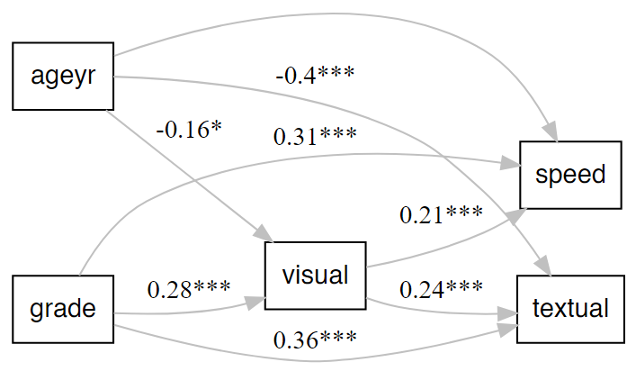

# Make a quick `lavaanPlot`

Make a quick and decent-looking `lavaanPlot`.

## Usage

``` r
nice_lavaanPlot(
  model,
  node_options = list(shape = "box", fontname = "Helvetica"),
  edge_options = c(color = "black"),
  coefs = TRUE,
  stand = TRUE,
  covs = FALSE,
  stars = c("regress", "latent", "covs"),
  sig = 0.05,
  graph_options = c(rankdir = "LR"),
  title = NULL,
  note = NULL,
  ...
)
```

## Arguments

- model:

  SEM or CFA model to plot.

- node_options:

  Shape and font name.

- edge_options:

  Colour of edges.

- coefs:

  Logical, whether to plot coefficients. Defaults to TRUE.

- stand:

  Logical, whether to use standardized coefficients. Defaults to TRUE.

- covs:

  Logical, whether to plot covariances. Defaults to FALSE.

- stars:

  Which links to plot significance stars for. One of
  `c("regress", "latent", "covs")`.

- sig:

  Which significance threshold to use to plot coefficients (defaults to
  .05). To plot all coefficients, set `sig` to 1.

- graph_options:

  Read from left to right, rather than from top to bottom.

- title:

  Optional title for the plot, positioned at the top. Plain text only;
  special characters like \<, \>, & are automatically escaped for
  Graphviz compatibility. Note: This will override any `label` or
  `labelloc` settings in `graph_options`.

- note:

  Optional note or caption for the plot, positioned at the bottom when
  used alone, or displayed below the title with smaller font when both
  are provided. Plain text only; special characters are automatically
  escaped. Note: This will override any `label` or `labelloc` settings
  in `graph_options`.

- ...:

  Arguments to be passed to function
  [lavaanPlot::lavaanPlot](http://alexlishinski.com/lavaanPlot/reference/lavaanPlot.md).

## Value

A lavaanPlot, of classes `c("grViz", "htmlwidget")`, representing the
specified `lavaan` model.

## Illustrations



## Examples

``` r
x <- paste0("x", 1:9)
(latent <- list(
  visual = x[1:3],
  textual = x[4:6],
  speed = x[7:9]
))
#> $visual
#> [1] "x1" "x2" "x3"
#> 
#> $textual
#> [1] "x4" "x5" "x6"
#> 
#> $speed
#> [1] "x7" "x8" "x9"
#> 

HS.model <- write_lavaan(latent = latent)
cat(HS.model)
#> ##################################################
#> # [-----Latent variables (measurement model)-----]
#> 
#> visual =~ x1 + x2 + x3
#> textual =~ x4 + x5 + x6
#> speed =~ x7 + x8 + x9
#> 

library(lavaan)
fit <- cfa(HS.model, HolzingerSwineford1939)
nice_lavaanPlot(fit)

{"x":{"diagram":" digraph plot { \n graph [ rankdir = LR ] \n node [ shape = box, fontname = Helvetica ] \n node [shape = box] \n x1; x2; x3; x4; x5; x6; x7; x8; x9 \n node [shape = oval] \n visual; textual; speed \n \n edge [ color = black ] \n  visual->x1 [label = \"0.77***\"] visual->x2 [label = \"0.42***\"] visual->x3 [label = \"0.58***\"] textual->x4 [label = \"0.85***\"] textual->x5 [label = \"0.86***\"] textual->x6 [label = \"0.84***\"] speed->x7 [label = \"0.57***\"] speed->x8 [label = \"0.72***\"] speed->x9 [label = \"0.67***\"] \n}","config":{"engine":"dot","options":null}},"evals":[],"jsHooks":[]}
# With title and note
nice_lavaanPlot(fit, title = "Three-Factor CFA Model", note = "Holzinger-Swineford Dataset")

{"x":{"diagram":" digraph plot { \n graph [ rankdir = LR, label = <<TABLE BORDER=\"0\" CELLBORDER=\"0\" CELLSPACING=\"0\"><TR><TD><FONT POINT-SIZE=\"14\"><B>Three-Factor CFA Model<\/B><\/FONT><\/TD><\/TR><TR><TD HEIGHT=\"10\"><\/TD><\/TR><TR><TD><FONT POINT-SIZE=\"10\">Holzinger-Swineford Dataset<\/FONT><\/TD><\/TR><\/TABLE>>, labelloc = t ] \n node [ shape = box, fontname = Helvetica ] \n node [shape = box] \n x1; x2; x3; x4; x5; x6; x7; x8; x9 \n node [shape = oval] \n visual; textual; speed \n \n edge [ color = black ] \n  visual->x1 [label = \"0.77***\"] visual->x2 [label = \"0.42***\"] visual->x3 [label = \"0.58***\"] textual->x4 [label = \"0.85***\"] textual->x5 [label = \"0.86***\"] textual->x6 [label = \"0.84***\"] speed->x7 [label = \"0.57***\"] speed->x8 [label = \"0.72***\"] speed->x9 [label = \"0.67***\"] \n}","config":{"engine":"dot","options":null}},"evals":[],"jsHooks":[]}
```
