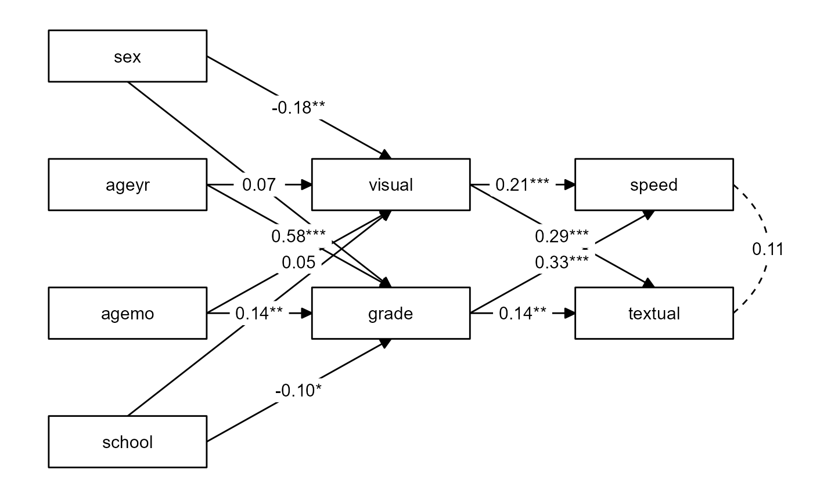

# Make a quick `tidySEM` plot

Make a quick and decent-looking `tidySEM` plot.

## Usage

``` r
nice_tidySEM(
  fit,
  layout = NULL,
  hide_nonsig_edges = FALSE,
  hide_var = TRUE,
  hide_cov = FALSE,
  hide_mean = TRUE,
  est_std = TRUE,
  label,
  label_location = NULL,
  reduce_items = NULL,
  plot = TRUE,
  ...
)
```

## Arguments

- fit:

  SEM or CFA model fit to plot.

- layout:

  A matrix (or data.frame) that describes the structure; see
  [tidySEM::get_layout](https://cjvanlissa.github.io/tidySEM/reference/get_layout.html).
  If a named list is provided, with names "IV" (independent variables),
  "M" (mediator), and "DV" (dependent variables), `nice_tidySEM`
  attempts to write the layout matrix automatically.

- hide_nonsig_edges:

  Logical, hides non-significant edges. Defaults to FALSE.

- hide_var:

  Logical, hides variances. Defaults to TRUE.

- hide_cov:

  Logical, hides co-variances. Defaults to FALSE.

- hide_mean:

  Logical, hides means/node labels. Defaults to TRUE.

- est_std:

  Logical, whether to use the standardized coefficients. Defaults to
  TRUE.

- label:

  Labels to be used on the plot. As elsewhere in `lavaanExtra`, it is
  provided as a named list with format `(colname = "label")`.

- label_location:

  Location of label along the path, as a percentage (defaults to middle,
  0.5).

- reduce_items:

  A numeric vector of length 1 (x) or 2 (x & y) defining how much space
  to trim from the nodes (boxes) of the items defining the latent
  variables. Can be provided either as `reduce_items = 0.4` (will only
  affect horizontal space, x), or `reduce_items = c(x = 0.4, y = 0.2)`
  (will affect both horizontal x and vertical y).

- plot:

  Logical, whether to plot the result (default). If `FALSE`, returns the
  `tidy_sem` object, which can be further edited as needed.

- ...:

  Arguments to be passed to
  [tidySEM::prepare_graph](https://cjvanlissa.github.io/tidySEM/reference/prepare_graph.html).

## Value

A tidySEM plot, of class ggplot, representing the specified `lavaan`
model.

## Illustrations



## Examples

``` r
# Calculate scale averages
library(lavaan)
data <- HolzingerSwineford1939
data$visual <- rowMeans(data[paste0("x", 1:3)])
data$textual <- rowMeans(data[paste0("x", 4:6)])
data$speed <- rowMeans(data[paste0("x", 7:9)])

# Define our variables
IV <- c("sex", "ageyr", "agemo", "school")
M <- c("visual", "grade")
DV <- c("speed", "textual")

# Define our lavaan lists
mediation <- list(speed = M, textual = M, visual = IV, grade = IV)

# Define indirect object
structure <- list(IV = IV, M = M, DV = DV)

# Write the model, and check it
model <- write_lavaan(mediation, indirect = structure, label = TRUE)
cat(model)
#> ##################################################
#> # [-----------Mediations (named paths)-----------]
#> 
#> speed ~ visual_speed*visual + grade_speed*grade
#> textual ~ visual_textual*visual + grade_textual*grade
#> visual ~ sex_visual*sex + ageyr_visual*ageyr + agemo_visual*agemo + school_visual*school
#> grade ~ sex_grade*sex + ageyr_grade*ageyr + agemo_grade*agemo + school_grade*school
#> 
#> ##################################################
#> # [--------Mediations (indirect effects)---------]
#> 
#> sex_visual_speed := sex_visual * visual_speed
#> sex_visual_textual := sex_visual * visual_textual
#> ageyr_visual_speed := ageyr_visual * visual_speed
#> ageyr_visual_textual := ageyr_visual * visual_textual
#> agemo_visual_speed := agemo_visual * visual_speed
#> agemo_visual_textual := agemo_visual * visual_textual
#> school_visual_speed := school_visual * visual_speed
#> school_visual_textual := school_visual * visual_textual
#> sex_grade_speed := sex_grade * grade_speed
#> sex_grade_textual := sex_grade * grade_textual
#> ageyr_grade_speed := ageyr_grade * grade_speed
#> ageyr_grade_textual := ageyr_grade * grade_textual
#> agemo_grade_speed := agemo_grade * grade_speed
#> agemo_grade_textual := agemo_grade * grade_textual
#> school_grade_speed := school_grade * grade_speed
#> school_grade_textual := school_grade * grade_textual
#> 

# Fit model
fit <- sem(model, data)

# Plot model
# \donttest{
nice_tidySEM(fit, layout = structure)

# }
```
